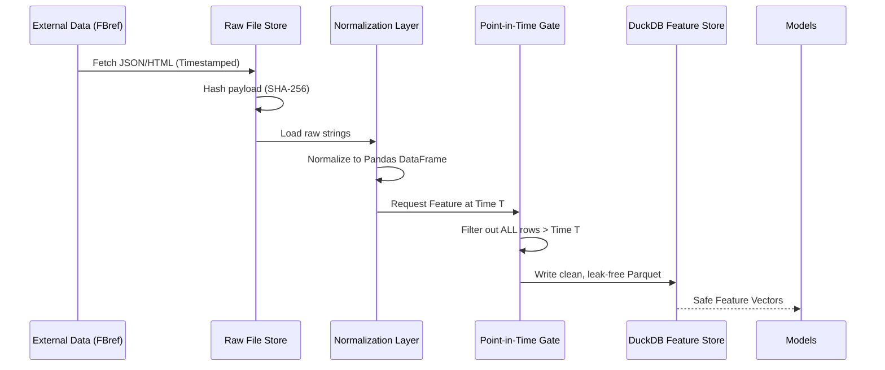

# wc2026 — FIFA World Cup 2026 Quant Prediction System

[](https://github.com/shreejitverma/wc2026-quant-prediction-system/actions/workflows/ci.yml)
[](#)
[](#)
[](#)

A production-grade, end-to-end quantitative prediction, fair-value pricing, and market-making system for the FIFA World Cup 2026. Designed for a solo quantitative operator targeting prediction markets (Kalshi, Polymarket).

> **Our Edge:** Model quality, information *timing* (lineup drops 60 mins pre-kickoff), settlement-rule precision, and cross-market joint coherence. Edge is **not** high-frequency speed. See `docs/adr/0006`.

---

## 🗺️ Quick Documentation Navigation (30-Second Audience Routing)

Choose your entry point depending on your role:

* 📊 **The Lead Quantitative Trader**
  * *Goal*: Understand the ensembler models, pricing models, and backtesting performance.
  * *Entry Points*: [Model Mathematical Theory](docs/explanation/model_theory.md) | [Market & Pricing Theory](docs/explanation/pricing_theory.md) | [Model Evaluation Dossier](docs/explanation/dossier.md)
* ⚙️ **The Systems Operator**
  * *Goal*: Set up clean environments, monitor health panels, and run incident runbooks under stress.
  * *Entry Points*: [Zero to First Prediction Tutorial](docs/tutorials/zero_to_first.md) | [Incident Triaging & SOPs](docs/howto/operations.md) | [CLI & Make Target Reference](docs/reference/cli_make.md)
* 💻 **The Quantitative Developer**
  * *Goal*: Add new prediction models, construct ingestion pipelines, or modify database schemas.
  * *Entry Points*: [End-to-End Prediction Trace](docs/tutorials/end_to_end_trace.md) | [Add a Predictive Model](docs/howto/add_model.md) | [Add an Ingestion Pipeline](docs/howto/add_data_source.md)

---

## 🧠 What Does This System Actually Do?

This is not a traditional betting model. This is a complete **quantitative execution stack** that:

1. **Ingests** historical match data, live orderbooks, Elo ratings, squad data, and venue context from multiple APIs.
2. **Fits six statistical models** (Dixon-Coles Bivariate Poisson, Dynamic State-Space, Bayesian Hierarchical, Player-Aggregation, LightGBM, Market-Implied) to predict exact scoreline distributions for every match.
3. **Simulates the entire World Cup tournament** 100,000 times per update cycle, producing precise conditional probability estimates for every possible tournament outcome.
4. **Prices contracts** on Kalshi and Polymarket by comparing our probabilities against live orderbooks to identify mispriced markets.
5. **Executes trades** (paper or live) with a cryptographically auditable ledger ensuring every decision is tamper-evident and reproducible.
6. **Displays** all of the above in a real-time Next.js/React operator console with live WebSocket streaming.

### Why Coherence Pricing Beats Speed

Most prediction markets fail at pricing conditional events correctly. If France scores an early goal against Brazil in Group G, human traders will drop Brazil's odds of winning *that specific match*. But they often forget to:

- Short Brazil's "Win the World Cup" contracts.
- Adjust Argentina's odds of facing Brazil in the Quarterfinals.
- Reprice all Group G qualification probabilities coherently.

Our **Coherence Pricing** engine solves the *entire* tournament mathematically every time a single event changes, allowing us to find arbitrage in secondary and tertiary derivative markets while retail traders focus on the primary event.

---

## 🏗️ System Architecture

The project consists of an **Execution Loop** bolted to an **Honesty Harness**.


### Data Provenance Flowchart

Before any model generates a prediction, data must pass through a rigid provenance and Point-In-Time (PIT) pipeline:



### Components Breakdown

| Component | Purpose |
|-----------|---------|
| **Data Ingestion** | Scrapes and normalizes raw JSON/HTML from prediction markets and statistical sources. |
| **Feature Store (DuckDB)** | Columnar, analytically-optimized store for fast feature retrieval. No network round-trips. |
| **Point-in-Time (PIT) Gate** | Structurally forbids models from seeing data from the future during backtesting — the single most critical anti-leakage component. |
| **Meta-Model Ensembler** | Dynamically combines six sub-models using log-loss-optimized BFGS weights to output a canonical `ScoreDist` matrix. |
| **Tournament Simulator** | Runs 100,000-path Monte Carlo simulations mapping the full tournament topology including FIFA tiebreakers and 3rd-place progression rules. |
| **Pricing & Execution** | Derives exact probabilities for any market contract, compares to live orderbooks, and manages execution. |
| **Honesty Harness** | Append-only cryptographic ledger (`wc2026.ledger`) ensuring quotes, prices, and performance metrics are tamper-evident. |

---

## 🚀 Quick Start

Ensure you have Python 3.12 and [uv](https://github.com/astral-sh/uv) installed.

```bash
# 1. Clone the repository
git clone https://github.com/shreejitverma/wc2026-quant-prediction-system.git
cd wc2026-quant-prediction-system

# 2. Setup the environment (pins Python 3.12, installs deps from uv.lock)
make setup

# 3. Install pre-commit hooks (Point-in-Time leakage gates, linting)
make hooks

# 4. Verify the system (runs pytest, coverage checks, self-check harness)
make verify

# 5. Run the Full Stack (Starts FastAPI Backend & Next.js Operator Console)
./run.sh
```

*The Operator Console will be available at `http://localhost:3000` (or `3001` if 3000 is in use). The backend Swagger docs are at `http://localhost:8000/docs`.*

### CLI Orchestrator Operations

For headless operations (e.g., cron jobs, CI pipelines), the backend can be invoked directly:

```bash
uv run python -m wc2026.ops.cron backtest    # Run historical evaluation
uv run python -m wc2026.ops.cron live        # Execute live trading logic
uv run python -m wc2026.ops.cron coherence   # Verify cross-market pricing coherence
```

---

## 📁 Repository Structure

```
wc2026-quant-prediction-system/
│
├── src/wc2026/               # Core Python package
│   ├── api/                  #   FastAPI server: REST + WebSocket endpoints
│   ├── models/               #   Six predictive models (M1-M6) + Meta-Ensembler
│   │   ├── dixon_coles.py    #     M1: Bivariate Poisson with τ low-score correction
│   │   ├── state_space.py    #     M2: Recursive rating filter (Elo-in-xG-space)
│   │   ├── hierarchical.py   #     M3: Bayesian NUTS MCMC (numpyro/JAX)
│   │   ├── player_agg.py     #     M4: Bottom-up xG aggregation from squad lineups
│   │   ├── gbm.py            #     M5: LightGBM Poisson regression
│   │   ├── market_implied.py #     M6: Market-implied Bivariate Poisson inversion
│   │   └── meta_ensemble.py  #     Ensembler: BFGS-optimized Log-Opinion Pooling
│   ├── simulator/            #   100k-path Monte Carlo tournament engine
│   ├── pricing/              #   Fair-value & coherence pricing modules
│   ├── execution/            #   Paper/live exchange adapters + kill-switches
│   ├── ingest/               #   Data fetchers for all external sources
│   ├── features/             #   DuckDB feature store with PIT gating
│   ├── eval/                 #   Backtesting, calibration, and CLV measurement
│   ├── ops/                  #   Cron orchestrator for all pipeline modes
│   ├── ledger.py             #   Append-only SHA-256 hash-chained audit log
│   ├── pit.py                #   Point-in-Time access gate (anti-leakage)
│   ├── hashing.py            #   Git provenance + content hashing
│   └── config.py             #   Pydantic strict config (Paper vs Live fencing)
│
├── frontend/                 # Vite/React Next.js Operator Console
│   ├── src/pages/            #   Dashboard, Matches, Opportunities, Ledger views
│   ├── src/components/       #   Reusable UI components
│   └── src/store/            #   Zustand state management
│
├── tests/                    # Test suite (>93% coverage requirement)
│   ├── unit/                 #   Unit tests for all modules
│   ├── benchmarks/           #   pytest-benchmark performance tests
│   └── integration/          #   End-to-end API integration tests
│
├── docs/                     # Documentation
│   ├── models.md             #   Mathematical deep-dive: M1-M6 + first principles
│   ├── architecture.md       #   System architecture and data flow
│   ├── runbook.md            #   Operational manual and deployment guide
│   ├── api-surface.md        #   Complete REST + WebSocket API reference
│   ├── adr/                  #   Architecture Decision Records (0001-0016)
│   ├── model_cards/          #   Per-model implementation catalog
│   ├── data_contracts/       #   Per-source data schema contracts
│   └── preregistrations/     #   Pre-registered experiment gates
│
├── scripts/                  # Self-check and validation scripts
│   ├── phase0_selfcheck.py   #   Harness integrity self-test
│   └── phase2_selfcheck.py   #   Feature store and PIT gate self-test
│
├── Makefile                  # Build, verify, lint commands
├── run.sh                    # Full stack launcher (API + UI)
└── pyproject.toml            # uv/PEP-621 project metadata
```

---

## 📚 Documentation Directory

| Document | What it covers |
|----------|---------------|
| **[docs/models.md](docs/models.md)** | **Start here.** First-principles math guide (Step 0), then rigorous LaTeX deep-dives into all 6 models: Dixon-Coles, State-Space, Bayesian Hierarchical, Player-Aggregation, LightGBM, Market-Implied, and Meta-Ensembler. Includes rationale, pros, cons, failure modes, and data schema for each. |
| **[docs/architecture.md](docs/architecture.md)** | Data flows, Monte Carlo simulator internals, execution pipeline, and the Honesty Harness cryptographic ledger. |
| **[docs/runbook.md](docs/runbook.md)** | Deployment, CLI modes, CI/CD pipeline, kill-switch procedures, troubleshooting, and disaster recovery matrix. |
| **[docs/api-surface.md](docs/api-surface.md)** | Complete REST and WebSocket API reference with endpoint descriptions, response shapes, and status tracking (real vs mock). |
| **[docs/adr/](docs/adr/)** | Architecture Decision Records explaining *why* we chose specific stacks (e.g. DuckDB over Postgres, Python over C++, log-opinion pooling over linear). |
| **[docs/model_cards/](docs/model_cards/)** | Per-model implementation catalog with links to source files and failure mode summaries. |
| **[docs/data_contracts/](docs/data_contracts/)** | Per-data-source contracts: schema, freshness, PIT `knowable_at` fields, and idempotency keys. |
| **[docs/preregistrations/](docs/preregistrations/)** | Pre-registered experiment gates: hypotheses, thresholds, and sample sizes committed *before* evaluation runs. |
| **[frontend/README.md](frontend/README.md)** | Architecture and setup instructions for the Next.js/Zustand/React-Query Operator Console. |

---

## 🛡️ The Honesty Harness

The core philosophy of this repository is **rigorous honesty with our results**. We assume that humans (including ourselves) will subconsciously cheat during backtesting. The harness prevents this *structurally* — not through discipline.

| Module | Role | Why it exists |
|--------|------|--------------|
| `wc2026.time_utils` | UTC-only timestamp discipline. Rejects naive datetimes. | Timezone-naive comparisons silently inject leakage. |
| `wc2026.hashing` | Git provenance + content hashing for 100% reproducibility. | A run from 6 months ago must be reproducible bit-for-bit. |
| `wc2026.pit` | Single point-in-time access gate for all model features. | Look-ahead bias is the dominant error term in sports prediction. |
| `wc2026.ledger` | Append-only, hash-chained, tamper-evident audit log of all trades. | Manual tampering of a past loss immediately breaks the chain. |
| `wc2026.config` | Strict Pydantic config fencing Paper Mode from Live credentials. | Prevents accidentally executing live trades in backtest mode. |

---

## 📈 Current System Status

**Phases 0–6 are fully built and verified.**

| Phase | Description | Status |
|-------|-------------|--------|
| 0 | Honesty Harness (ledger, PIT gate, config, hashing) | ✅ Complete |
| 1 | Data ingestion (FBref, Elo, Kalshi, Polymarket) | ✅ Complete |
| 2 | Feature Store (DuckDB, PIT-gated Parquet) | ✅ Complete |
| 3 | Model suite: M1-M6 + Meta-Ensembler | ✅ Complete |
| 4 | Tournament Simulator (100k-path Monte Carlo) | ✅ Complete |
| 5 | Pricing Engine (Fair Value + Coherence) | ✅ Complete |
| 6 | Operator Console (Next.js + WebSocket streaming) | ✅ Complete |
| 7 | Live Execution + CLV Measurement | 🔄 Planned |

- **151 tests pass**, coverage > 93%.
- **100k-path simulator benchmarks at sub-millisecond** execution times.
- The **Next.js Operator Console** streams live (simulated) WebSocket orderbook data.
- The system is **live-capable**, waiting behind the final pre-registration gates.
