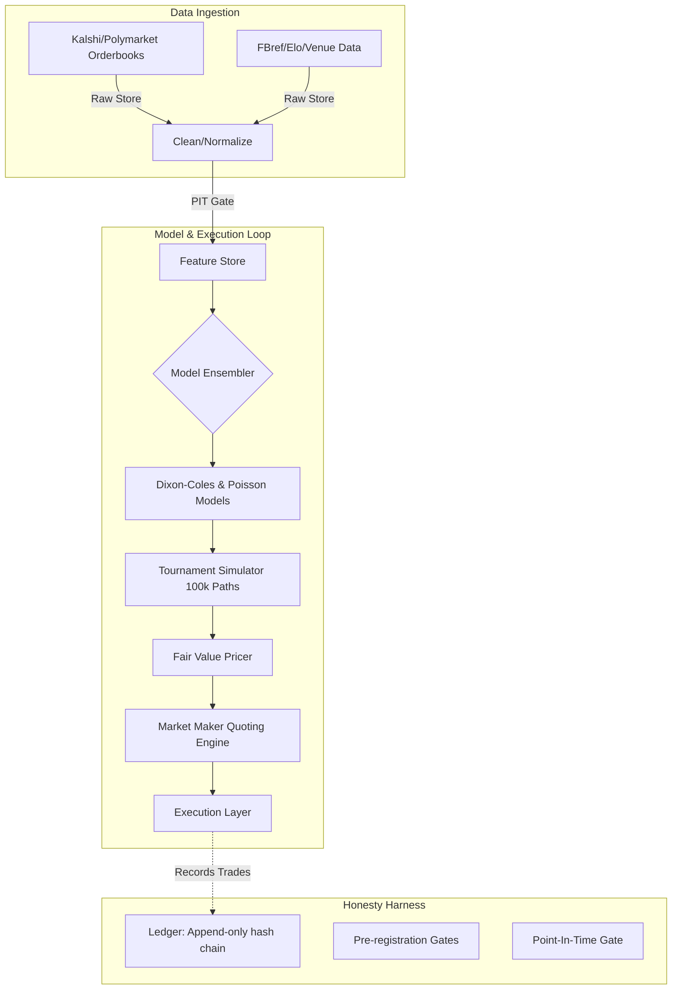

# wc2026

FIFA World Cup 2026 prediction, fair-value pricing, and market-making system.

Predicts the full joint distribution over match and tournament events, prices every relevant Kalshi/Polymarket contract at fair value with uncertainty bands, and market-makes those contracts (paper first, live only behind pre-registered gates).

> Edge here is model quality, information *timing*, settlement-rule precision, and cross-market coherence — **not speed**. See `docs/adr/0006`.

## Quick start

```bash
curl -LsSf https://astral.sh/uv/install.sh | sh   # if uv not installed
make setup     # venv (pinned Python 3.12) + deps from uv.lock
make hooks     # pre-commit incl. the point-in-time leakage gate
make verify    # ruff + pytest + end-to-end self-check  (the Phase 0 gate)

# Run the CLI Orchestrator
uv run python -m wc2026.ops.cron backtest
uv run python -m wc2026.ops.cron live
uv run python -m wc2026.ops.cron coherence
```

## System Overview



## What Phase 0 gives you (the honesty harness)

| Module | Role |
|--------|------|
| `wc2026.time_utils` | UTC-only timestamp discipline (rejects naive datetimes) |
| `wc2026.hashing` | content hashing + git provenance (reproducibility contract) |
| `wc2026.pit` | the single point-in-time, leak-proof access gate (Decision 1) |
| `wc2026.ledger` | append-only, hash-chained, tamper-evident audit log |
| `wc2026.runs` | reproducible experiment/run records |
| `wc2026.config` | strict (extra-forbidding) Pydantic config; fences paper mode + no-autonomous-LLM |

## Documentation

- `docs/architecture.md` — the system map (the loop + the harness).
- `docs/adr/` — Architecture Decision Records (why, and why-not).
- `docs/runbook.md` — setup, verification, reproducibility, kill switches.

## Status

**Phases 0–8 are fully built and verified.** The system is live-capable behind the pre-registration and paper-execution gates.
