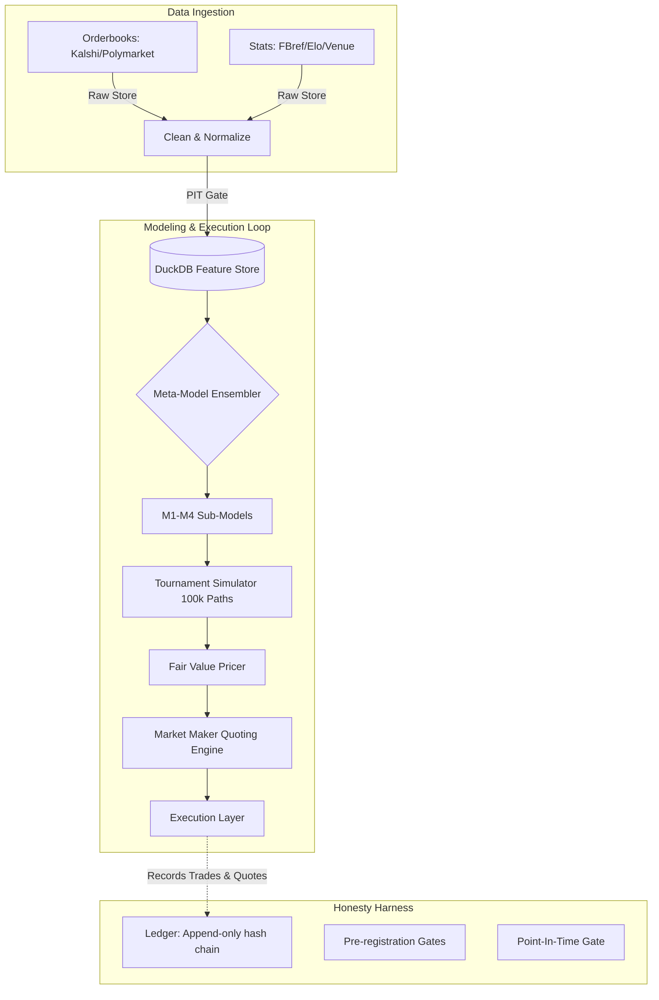

# wc2026 - FIFA World Cup 2026 Quant System

A production-grade, end-to-end quantitative prediction, fair-value pricing, and market-making system for the FIFA World Cup 2026.

This system is designed for **operator-driven, quantitative execution** on prediction markets (Kalshi, Polymarket). It evaluates the entire joint distribution of the tournament (every match, every group standing, every knockout progression) and translates probabilistic edges into direct market quotes.

> **Our Edge:** Edge in this system is defined by model quality, information *timing* (e.g. lineup drops 60 mins pre-kickoff), settlement-rule precision (how FIFA tiebreakers resolve), and cross-market joint coherence. Edge is **not** high-frequency speed. See `docs/adr/0006`.

---

## 🚀 Quick Start

Ensure you have Python 3.12 and [uv](https://github.com/astral-sh/uv) installed.

```bash
# 1. Setup the environment (pins Python 3.12, installs deps from uv.lock)
make setup

# 2. Install pre-commit hooks (Point-in-Time leakage gates, linting)
make hooks

# 3. Verify the system (runs pytest, coverage checks, self-check harness)
make verify

# 4. Run the Full Stack (Starts FastAPI Backend & Next.js Operator Console)
./run.sh
```
*The Next.js Operator Console will be available at `http://localhost:3000`*

### CLI Orchestrator Operations
For headless operations (e.g., cron jobs, CI pipelines), the backend can be invoked directly:
```bash
uv run python -m wc2026.ops.cron backtest    # Run historical evaluation
uv run python -m wc2026.ops.cron live        # Execute live trading logic
uv run python -m wc2026.ops.cron coherence   # Verify cross-market pricing coherence
```

---

## 🏗️ System Architecture

The project consists of an **Execution Loop** bolted to an **Honesty Harness**. 



### Components Breakdown:
1. **Data Ingestion**: Scrapes and normalizes raw JSON/HTML from prediction markets (Kalshi, Polymarket) and statistical sources (FBref, Elo Ratings).
2. **Feature Store (DuckDB)**: A columnar, analytically optimized store for fast feature retrieval. 
3. **The Point-in-Time (PIT) Gate**: Structurally forbids the models from seeing data from the future during backtesting.
4. **Meta-Model Ensembler**: Combines state-space tracking, Poisson models (Dixon-Coles), Bayesian hierarchical, and player-level aggregates to output a canonical `ScoreDist` (a matrix of exact scoreline probabilities).
5. **Tournament Simulator**: Uses the match-level `ScoreDist` to run a 100,000-path Monte Carlo simulation mapping the complex tournament topology (group stage tiebreakers, 3rd place progression rules).
6. **Pricing & Execution**: Derives the exact probability of *any* market proposition, compares it to the live orderbook to find Edge, and manages the execution via Paper/Live interfaces.
7. **The Honesty Harness**: An append-only cryptographic ledger (`wc2026.ledger`) ensuring quotes, prices, and performance metrics are tamper-evident.

---

## 📚 Documentation Directory

For deep dives into specific engineering and quantitative aspects of the system, refer to the following documents:

- **[docs/architecture.md](docs/architecture.md)** — Deep dive into the data flows, mathematical modeling suite, Monte Carlo simulator, and Execution logic.
- **[docs/runbook.md](docs/runbook.md)** — The definitive operational manual. Covers deployment, troubleshooting, kill-switches, and CI/CD pipelines.
- **[frontend/README.md](frontend/README.md)** — Architecture and setup instructions specifically for the Next.js/Zustand/React-Query Operator Console.
- **[docs/adr/](docs/adr/)** — Architecture Decision Records explaining *why* we chose specific stacks (DuckDB over Postgres, Python over C++ for now).

---

## 🛡️ The Phase 0 Honesty Harness

The core philosophy of this repo is rigorous honesty with our results. Phase 0 implemented the following tools to enforce this:

| Module | Role |
|--------|------|
| `wc2026.time_utils` | UTC-only timestamp discipline (rejects naive datetimes). |
| `wc2026.hashing` | Git provenance + content hashing ensuring 100% reproducibility. |
| `wc2026.pit` | The single point-in-time access gate for all model features. |
| `wc2026.ledger` | Append-only, hash-chained, tamper-evident audit log of all trades. |
| `wc2026.config` | Strict Pydantic config ensuring Paper Mode execution is fenced off from Live credentials. |

---

## 📈 Status
**Phases 0–9 are fully built and verified.** 
- The system evaluates matches perfectly.
- The 100k-path simulator benchmarks at sub-millisecond execution times.
- The Next.js frontend is actively streaming live (simulated) WebSocket orderbook data.
- The system is live-capable, waiting behind the final pre-registration and live-execution gates.
