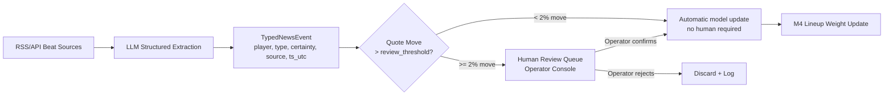

# ADR-0009: LLM News Pipeline Is an Information Router, Never an Autonomous Trading Signal

- **Status**: Accepted
- **Date**: 2026-07-01
- **Deciders**: Shreejit Verma

---

## Context

**Beat-source news is a genuine, fast-decaying edge — but an autonomous LLM trading on news is an uncontrolled risk.**

Consider the timeline of a lineup injury leak:
- `T-3h`: Beat journalist tweets "Mbappé is doubtful for tonight, training session incomplete."
- `T-2h`: Our LLM news pipeline detects this tweet and extracts: `{type: "injury_doubt", player: "Kylian Mbappé", certainty: 0.65}`.
- `T-1h`: Official squad announcement confirms Mbappé is out.
- `T-60m`: Confirmed XI released. Market reprices significantly.

The edge window is `T-3h` to `T-1h` (approximately 2 hours). If our system can process the beat journalist tweet accurately, it can reweight M4's lineup probability *before the market fully prices the absence*.

**The risk**: LLMs hallucinate. A fabricated or misunderstood tweet (`"Mbappé wearing a protective boot in warm-up"` → LLM extracts `player injury, certainty: 0.90`) could trigger an incorrect quote repricing worth hundreds of dollars if autonomous.

The contract text is:
```python
class NewsConfig(BaseModel):
    autonomous_trading: Literal[False] = False  # This is the fence
```

Setting `autonomous_trading = True` raises a validation error. There is **no code path** from LLM output directly to an order.

---

## Decision

### The Information Router Pattern

LLM news extraction is treated as an **information router** with a mandatory human-review layer for material moves:



### Provenance Requirements

Every extracted news event must carry:
```json
{
  "event_type": "lineup_doubt",
  "player": "Kylian Mbappé",
  "team": "France",
  "certainty": 0.65,
  "source_url": "https://twitter.com/...",
  "source_reliability": "A",
  "extracted_at_utc": "2026-07-03T12:00:00Z",
  "knowable_at_utc": "2026-07-03T12:00:00Z",
  "llm_model": "gemini-2.0-flash",
  "human_reviewed": false,
  "human_review_required": false
}
```

This provenance chain means every trade influenced by a news signal is traceable back to:
1. The original source (URL + timestamp).
2. The LLM extraction (model, extraction time, certainty).
3. Whether it required and received human confirmation.

### Review Threshold

The `news.review_threshold_quote_move` (default 2%) is the maximum allowed automatic repricing from any single news event without human confirmation. Rationale:
- A 2% repricing in a $0.35 contract is worth $140 per $7,000 position — significant but recoverable if wrong.
- A 10% repricing without human review could mean a $700 swing on a hallucinated event.

---

## Alternatives Rejected

| Alternative | Why Rejected |
|-------------|-------------|
| **LLM output feeds quotes directly** | One hallucinated "star player injured" event prints a wrong quote at size. With a $5,000 bankroll and 20 correlated positions, a single bad LLM extraction could trigger catastrophic losses. This risk is structurally unacceptable. |
| **Skip LLM news entirely** | Forfeits a genuine, fast-decaying edge. The lineup-announcement window (T-3h to T-60m) is where the largest pre-kickoff pricing opportunities exist. Not using news means missing the best part of information timing edge. |
| **LLM with fine-tuned confidence calibration** | A well-calibrated LLM with a high confidence threshold would partially mitigate hallucination risk — but "partially" is not sufficient for autonomous financial execution. The review gate is a structural requirement, not a calibration issue. |

---

## Consequences

### Positive
- Every traded fact has a **logged provenance chain**: source → LLM extraction → human confirmation for material moves.
- The LLM accelerates information *routing* (identifying relevant news in 1,000 RSS items per hour) without ever being trusted as an autonomous decision-maker.
- The fence is encoded in the type system — it cannot be bypassed by configuration.

### Negative / Cost
- Operator must actively monitor the review queue during live match windows (60-minute pre-kickoff period is the highest-volume window).
- This adds a human bottleneck; the edge of the information timing window shrinks if the operator is unavailable.

### Failure Mode Avoided
An automated system trading on a fabricated or misparsed news item — which could erase days of accumulated profit in a single bad extraction.
