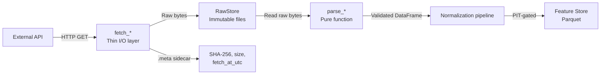

# ADR-0010: Fetch/Parse Separation in Every Ingest Module

- **Status**: Accepted
- **Date**: 2026-07-01
- **Deciders**: Shreejit Verma

---

## Context

Data ingestion is where **bugs hide most effectively**. A parsing bug that silently produces wrong training data (e.g., treating "away_score" as "home_score" due to a column swap) can corrupt six months of model training without triggering any exception.

Three requirements drive the architecture:
1. **Testability without network access**: CI pipelines must be hermetic. A test that calls `requests.get("https://fbref.com/...")` is flaky, slow, and fails on network errors. All parse logic must be testable from file fixtures.
2. **Reproducibility**: If a schema change requires re-parsing, we must be able to re-run the parse on the *original raw payload* without re-fetching from the API. Many APIs rate-limit aggressively; a re-fetch could mean waiting hours.
3. **Debuggability**: When a model produces an anomalous prediction, the first debugging step should be "look at the raw input." If the raw payload was discarded after parsing, this is impossible.

---

## Decision

Every ingest module exposes exactly two distinct layers, with a clean interface boundary between them:

### Layer 1: `fetch_*()`

```python
def fetch_elo_ratings(store: RawStore, as_of: datetime) -> Path:
    """
    Thin I/O layer. Responsibilities:
    - Check if a cached raw file exists for today (idempotent: no-op if so)
    - Fetch from the external API if not cached
    - Write the raw payload to RawStore exactly as received (no transformation)
    - SHA-256 hash the payload and write a .meta sidecar file
    - Handle rate limiting and retry with exponential backoff
    - Return the path to the raw file
    """
```

**Properties of `fetch_*()`:**
- **Idempotent**: Running it twice produces the same result (second call is a no-op if the file exists).
- **No transformation**: The raw payload is written byte-for-byte as received.
- **Logged**: Every fetch records `source_url`, `fetch_at_utc`, `sha256`, `size_bytes` to the meta file.

### Layer 2: `parse_*()`

```python
def parse_elo_ratings(raw: str, as_of: datetime) -> pd.DataFrame:
    """
    Pure function. Responsibilities:
    - Takes raw string/bytes as input
    - Returns a validated, typed Python object (DataFrame, dataclass, etc.)
    - No I/O. No network calls. No file reads or writes. No side effects.
    - Raises ParseError with specific field name if validation fails
    """
```

**Properties of `parse_*()`:**
- **Pure function**: Same input always produces same output.
- **No side effects**: Cannot touch the network, file system, or database.
- **Validated**: Every output field is type-checked; missing fields raise a named `ParseError`.
- **Testable in isolation**: Tested with file fixtures; never needs network access.

### Complete Ingest Workflow



### Testing Strategy

```python
# Tests for parse logic use file fixtures — never the network
@pytest.fixture
def raw_elo_fixture():
    return (Path("tests/fixtures/elo_ratings_2026-07-01.html")).read_text()

def test_parse_elo_ratings(raw_elo_fixture):
    df = parse_elo_ratings(raw_elo_fixture, as_of=datetime(2026, 7, 1, tzinfo=UTC))
    assert "team" in df.columns
    assert "elo" in df.columns
    assert df["elo"].dtype == float
    assert df["elo"].between(1000, 2200).all()

# Tests for fetch logic verify RawStore idempotency (no network needed)
def test_fetch_idempotent(tmp_path, mock_store):
    mock_store.set_response(200, b"<html>elo data</html>")
    path1 = fetch_elo_ratings(mock_store, datetime.now(UTC))
    path2 = fetch_elo_ratings(mock_store, datetime.now(UTC))
    assert path1 == path2  # Same file, no duplicate fetch
    assert mock_store.fetch_count == 1  # Only fetched once
```

---

## Alternatives Rejected

| Alternative | Why Rejected |
|-------------|-------------|
| **Parse inside fetch (combined function)** | Cannot test parse logic without hitting the network. Raw payload is discarded after parsing, making debugging impossible. Schema changes require re-fetching. |
| **Parse on-the-fly, discard raw** | Breaks reproducibility: a parse bug discovered after 6 months cannot be fixed by re-parsing — must re-fetch from API (if still available). |
| **Lazy parsing (parse at query time)** | Errors surface at model training time, not at ingest time — much harder to debug. Also slower (re-parses on every read). |

---

## Consequences

### Positive
- **Raw payloads are always available** for debugging and re-parse, regardless of how many times the schema changes.
- **Tests are fast and hermetic**: The full parse test suite runs in <2 seconds with no network.
- **Schema changes become re-parse passes** on stored raw files, not re-fetch operations.
- **Debugging path**: For any anomalous model output, the exact raw input is on disk and inspectable.

### Negative / Cost
- Disk space for raw storage: Typically small (HTML pages are 50–200 KB each; JSON APIs even smaller). For a full tournament season, raw storage is well under 1 GB.
- A fetch function stub is required for every new data source (small but non-zero overhead).

### Failure Mode Avoided
A parse bug that silently produces wrong training data (e.g., a column swap in the Elo table) without a recoverable raw payload to debug against. Without fetch/parse separation, discovering this bug 3 months later means losing the ability to diagnose exactly what happened.
