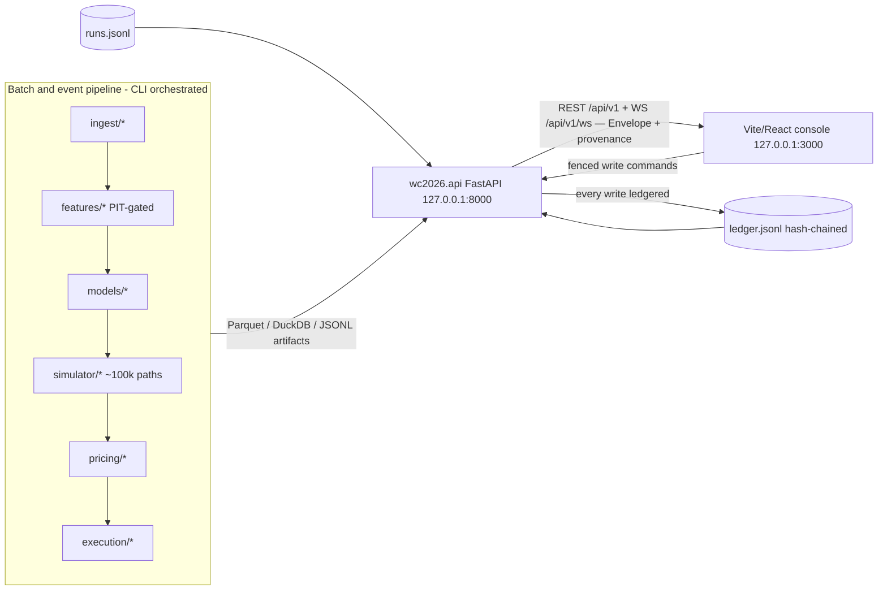

# API Surface — The Operator Console's Contract with the Quant Harness

**Status**: Living document. Update whenever an endpoint changes status.
**Governing ADRs**: ADR-0011 (stack), ADR-0012 (provenance envelope), ADR-0014 (multiplexed WebSocket), ADR-0015 (frontend toolchain).

---

## Design Philosophy

> **The frontend is a client of the honesty harness, never a bypass.**

Every response body wraps its payload in a `Provenance Envelope`:

```typescript
type Envelope<T> = {
  data: T;
  provenance: {
    source: "real" | "mock";   // Is this live data or a labeled mock?
    generated_at: string;       // ISO 8601 UTC timestamp of this response
    data_as_of: string;         // ISO 8601 UTC timestamp of the underlying data
    run_id: string;             // ID of the pipeline run that generated this
    git_commit: string;         // Exact git commit hash of the running codebase
    config_hash: string;        // SHA-256 of the active configuration
  };
}
```

**Why does this matter?** The `source` field prevents the operator from confusing a mock data output with a validated real output. The `git_commit` and `config_hash` fields mean every prediction shown on screen is cryptographically traceable to the exact version of code and configuration that produced it.

**Read/write discipline**:
- Reads are generous — any endpoint can be polled freely.
- Writes are few, fenced server-side, and every write produces a ledger entry.
- The UI cannot bypass exchange execution fences; it can only request actions.

---

## System Architecture



The pipeline **writes** artifacts; the API **only reads** them (plus the few fenced command endpoints). The frontend never touches artifacts, exchanges, or secrets directly.

---

## REST Read Endpoints

All endpoints return `Envelope<T>`. The `source` field in the provenance indicates whether data is live (`"real"`) or a labeled mock (`"mock"`).

### System Health

#### `GET /api/v1/health`
**Backing module**: `config` + ledger staleness check vs `max_data_staleness_seconds`.
**Status**: ✅ **real**

Returns overall system health. Checks:
- Active configuration mode (`paper` or `live`).
- Ledger chain integrity (last verified timestamp).
- Data freshness: is the feature store stale beyond the configured threshold?

**Response shape:**
```json
{
  "data": {
    "mode": "paper",
    "ledger_ok": true,
    "data_fresh": true,
    "last_data_at": "2026-07-03T02:00:00Z"
  },
  "provenance": { "source": "real", "git_commit": "5e14e0b", ... }
}
```

---

### Ledger

#### `GET /api/v1/ledger?after_seq=&limit=`
**Backing module**: `wc2026.ledger` → `data/ledger/ledger.jsonl`.
**Status**: ✅ **real**

Returns paginated ledger entries. Use `after_seq` to implement cursor-based pagination. Every entry includes the `sha256_prev` of the preceding entry, forming the cryptographic chain.

#### `GET /api/v1/ledger/verify`
**Backing module**: Hash-chain integrity walk.
**Status**: ✅ **real**

Walks the entire ledger chain and verifies that every `sha256_prev` matches the actual SHA-256 of the preceding entry. Returns `{ valid: true/false, broken_at_seq: null | number }`.

---

### Pipeline Runs

#### `GET /api/v1/runs`
#### `GET /api/v1/runs/{run_id}`
**Backing module**: `wc2026.runs` → `data/runs/runs.jsonl`.
**Status**: ✅ **real**

Returns metadata about past pipeline execution runs. Each run record contains:
- `run_id`: UUID of the run.
- `git_commit`: Exact codebase hash.
- `config_hash`: SHA-256 of the config used.
- `mode`: `backtest` / `live` / `coherence`.
- `created_at`, `completed_at`.
- Summary metrics (overall log-loss, number of contracts priced).

---

### Match Predictions

#### `GET /api/v1/matches`
**Backing module**: `models.meta_ensemble` outputs.
**Status**: 🟡 **built, mock** (internally coherent — probabilities derived from real model matrices)

Returns a list of upcoming match predictions. For each match:
- `match_id`, `home_team`, `away_team`.
- `expected_goals_home`, `expected_goals_away` (from the ensemble).
- `prob_home_win`, `prob_draw`, `prob_away_win` (derived from the ScoreDist matrix).
- `scoreline_matrix`: The full 15×15 probability grid.
- `uncertainty_score`: A measure of how much the 6 sub-models disagree.

#### `GET /api/v1/matches/{id}`
**Status**: 🟡 **built, mock**

Returns full detail for a single match, including:
- Per-model probabilities (M1 through M6 individually).
- Ensemble weights at this moment in time.
- Feature attribution (which features most influenced the prediction).
- Venue info (altitude, neutral flag, rest days for each team).
- Lineup status (expected XI vs confirmed XI — the M4 trigger).

#### `GET /api/v1/matches/{id}/timeline`
**Status**: 🟡 **built, mock**

Returns the history of fair value vs market price for a match contract over time. Includes event markers for key information releases (lineup confirmation, goal events, news drops). Used to visualize how our model's edge evolved over the pre-match window.

---

### Opportunities & Coherence

#### `GET /api/v1/opportunities`
**Backing module**: `pricing.{fair_value, mapper, coherence}`.
**Status**: 🟡 **built, mock**

Returns ranked list of current trading opportunities. For each opportunity:
- `contract_id`: Exchange-specific contract identifier.
- `fair_value`: Our model's probability × $1.00.
- `market_ask` / `market_bid`: Live exchange prices.
- `edge_after_fee`: `fair_value - market_ask - exchange_fee`.
- `classification`: `STRONG_BUY` / `BUY` / `MONITOR` / `FLAT`.
- `settlement_mapping`: Exact description of how the contract resolves (e.g. "advances" vs "wins in 90 minutes").

#### `GET /api/v1/coherence`
**Backing module**: `pricing.coherence` + sim draws.
**Status**: 🟡 **built, mock**

Returns detected coherence violations across venues:
- **Cross-venue rows**: Same event priced differently on Kalshi vs Polymarket.
- **Internal violations**: Bracket path product inconsistencies (e.g. "Brazil wins all three matches" priced higher than "Brazil tops Group G").

---

### Tournament & Joint Queries

#### `GET /api/v1/tournament`
**Backing module**: `wc2026.api.mock_tournament` draw table (swaps to the simulator's persisted draws).
**Status**: 🟡 **built, mock** — a real draw-counting engine over 20k fake draws; every probability (group positions, best-thirds, round-reach, winner) is counted from one table, and winner probabilities carry Wilson 95% intervals from the counts.

#### `POST /api/v1/sim/query`
**Status**: 🟡 **built, mock**

Joint probability of 1–4 `(team, outcome)` events, COUNTED from the draws (never multiplied marginals). Returns `p` with Wilson CI, `n_draws`, `n_hits`, the naive `independent_product`, and `dependence_ratio` — the coherence edge made visible.

---

## Planned Endpoints (Future Phases)

| Endpoint | Description | Phase |
|----------|-------------|-------|
| `GET /api/v1/contracts/{id}/fair-value` | Full fair-value decomposition waterfall | 3 |
| `GET /api/v1/books/{ticker}` | Live orderbook depth + recent history | 3 |
| `GET /api/v1/portfolio` | Position view with correlation clusters and limit utilization | 4 |
| `GET /api/v1/eval/*` | CLV measurement, calibration curves, model race | 5 |
| `GET /api/v1/prereg` | Pre-registration status for active experiments | 5 |
| `GET /api/v1/ops/*` | Pipeline freshness and cron history | 6 |

---

## Live Channel — `WS /api/v1/ws`

One multiplexed WebSocket connection handles all real-time feeds. This avoids polling overhead and allows the frontend to subscribe to only the topics it needs.

### Protocol

**Client → Server** (subscribe):
```json
{ "subscribe": ["health", "ledger", "book.USA-QF"], "after_seq": 142 }
```

**Client → Server** (unsubscribe):
```json
{ "unsubscribe": ["book.USA-QF"] }
```

**Server → Client** (every message):
```json
{
  "topic": "ledger",
  "source": "real",
  "ts_utc": "2026-07-03T03:00:00Z",
  "data": { ... }
}
```

Subscribing immediately pushes a snapshot of the current state for that topic. Subsequent messages are incremental updates.

### Available Topics

| Topic | Status | Description |
|-------|--------|-------------|
| `health` | ✅ **real** | System health snapshot, byte-identical to REST `/health` |
| `ledger` | ✅ **real** | New ledger entries; `after_seq` in the subscribe message backfills |
| `book.<ticker>` | 🟡 **mock** | Live orderbook depth for a specific contract; real when snapshot persistence is built |
| `quotes.<market>` | 🔄 Planned Phase 4 | Our own quoted prices as they update |
| `fills` | 🔄 Planned Phase 4 | Fill confirmations from exchanges |
| `alerts` | 🔄 Planned Phase 6 | System alerts (staleness, kill-switch triggers) |
| `pipeline` | 🔄 Planned Phase 6 | Cron job progress and freshness updates |

---

## Write Endpoints (Fenced, Planned)

Writes are rare, validated server-side, and always produce a ledger entry.

| Endpoint | What it does | Gate | Phase |
|----------|-------------|------|-------|
| `POST /api/v1/alerts/{id}/ack` | Acknowledge a system alert | Ledgered acknowledgment | 6 |
| `POST /api/v1/quoting/{market}/pause` | Pause quoting for a specific market | Ledgered pause | 4 |
| `POST /api/v1/quoting/{market}/resume` | Resume quoting; requires typed confirmation in live mode | Confirmation required | 4 |
| `POST /api/v1/limits/{cluster}` | Update position limit for a correlation cluster | Rejected outside pre-registered bounds | 4 |
| `POST /api/v1/kill-switch` | Pull all quotes immediately | Idempotent; no undo endpoint — re-arming is a CLI act | 4 |

---

## API Change Discipline

- **Breaking schema changes** require a new `/api/v2` prefix. The generated TypeScript client turns unhandled schema drift into compile errors.
- **New endpoints** must declare their `source` (`real` vs `mock`) before shipping.
- When an endpoint moves from `mock` → `real`, **update this table in the same commit** as the code change.
