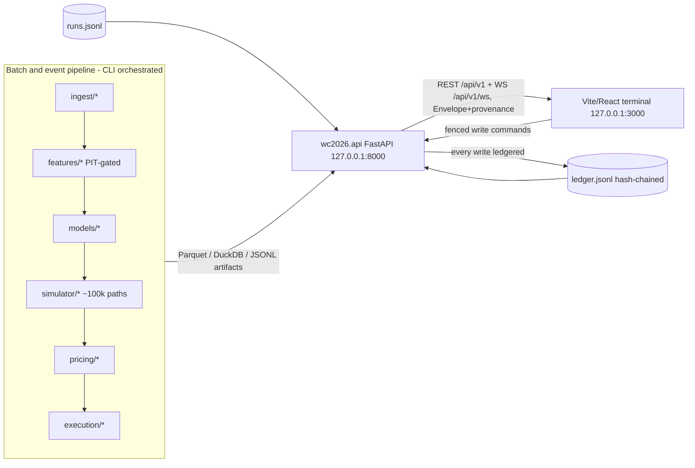

# API surface — the terminal's contract with the harness

Status: living document (Phase 0 deliverable; update whenever an endpoint changes status).
Governing ADRs: 0011 (stack), 0012 (provenance envelope), 0014 (multiplexed WebSocket), 0015 (frontend toolchain).

Every response body is `Envelope[T] = {data, provenance}` where provenance carries `source: "real"|"mock"`, `generated_at`, `data_as_of`, `run_id`, `git_commit`, `config_hash`.
The UI is a client of the honesty harness, never a bypass: reads are generous, writes are few, fenced server-side, and every write produces a ledger entry written by the backend.

## Architecture

The pipeline writes artifacts; the API only reads them (plus the few fenced command endpoints).
The frontend never touches artifacts, exchanges, or secrets.

## Read endpoints

| Endpoint | Backing module(s) / artifact | Status |
|---|---|---|
| `GET /api/v1/health` | `config` + ledger staleness vs `max_data_staleness_seconds` | **real** |
| `GET /api/v1/ledger?after_seq=&limit=` | `wc2026.ledger` (`data/ledger/ledger.jsonl`) | **real** |
| `GET /api/v1/ledger/verify` | hash-chain integrity walk | **real** |
| `GET /api/v1/runs`, `GET /api/v1/runs/{run_id}` | `wc2026.runs` (`data/runs/runs.jsonl`) | **real** |
| `GET /api/v1/matches` | fixtures + `models.meta_ensemble` outputs | built, **mock** |
| `GET /api/v1/matches/{id}` — per-model probs, scoreline matrix, ensemble weights, feature attribution, venue/rest/lineup header | `models/*`, `features.store` | built, **mock** (internally coherent; probs derived from served matrices) |
| `GET /api/v1/matches/{id}/timeline` — market price vs fair value + band + event markers (lineups, goals, news) | order-book history + FV snapshots | built, **mock** |
| `GET /api/v1/tournament` — bracket/group/third-place advancement probabilities | `simulator.{engine,group_stage,bracket_rules}` persisted draws | planned (Phase 2) |
| `POST /api/v1/sim/query` — joint-event probability from persisted draws | simulator draws in Parquet, DuckDB | planned (Phase 2) |
| `GET /api/v1/contracts/{id}/fair-value` — decomposition: model prob → fee → timing → resolution risk; settlement mapping + confirmation status | `pricing.{fair_value,mapper}` | planned (Phase 3) |
| `GET /api/v1/opportunities` — ranked by risk-adjusted after-fee edge; fair ± band, depth, classification, fair-value waterfall (sums exactly), settlement mapping with confirmation status | `pricing.{fair_value,mapper,coherence}` | built, **mock** (derived from the same match cores as `/matches`) |
| `GET /api/v1/coherence` — cross-venue rows + internal bracket-path-product violations | `pricing.coherence` + sim draws | built, **mock** |
| `GET /api/v1/books/{ticker}?depth=&history=` | `ingest.orderbooks` (snapshot persistence required first) | planned (Phase 3/4) |
| `GET /api/v1/portfolio` — positions by correlation cluster, limits, optimizer target vs actual | `execution.portfolio` | planned (Phase 4) |
| `GET /api/v1/eval/{clv,calibration,scores,model-race}` — every figure ships with `n` and CI in the schema | `eval.{metrics,backtest}` | planned (Phase 5) |
| `GET /api/v1/prereg` — pre-registration gates: frozen params, thresholds, status | `docs/preregistrations` + config | planned (Phase 5) |
| `GET /api/v1/ops/{pipeline,freshness}` | `ops.cron` history, ingest timestamps | planned (Phase 6) |

## Live channel — `WS /api/v1/ws` (ADR-0014)

One socket; client sends `{"subscribe": [...], "after_seq"?: N}` / `{"unsubscribe": [...]}`; every message is `{topic, source, ts_utc, data}`.
Subscribing pushes an immediate snapshot.

| Topic | Status |
|---|---|
| `health` | **real** (byte-identical envelope to REST, shared builder) |
| `ledger` | **real** (cursor-tailed; `after_seq` backfills) |
| `book.<ticker>` | **mock** until order-book snapshots persist |
| `quotes.<market>`, `fills`, `alerts`, `pipeline` | planned (Phases 4/6) |

## Write endpoints — few, fenced, all planned

The fence is server-side: the API rejects out-of-bounds requests; UI-side checks are a courtesy only.
Every accepted write is ledgered by the backend.

| Endpoint | Fence | Phase |
|---|---|---|
| `POST /api/v1/alerts/{id}/ack` | ledgered acknowledgment | 6 |
| `POST /api/v1/quoting/{market}/pause` · `/resume` | `execution.quoting`; resume in live mode requires typed confirmation | 4 |
| `POST /api/v1/limits/{cluster}` | rejected outside pre-registered bounds | 4 |
| `POST /api/v1/kill-switch` | `execution.kill_switches`; idempotent; no un-kill endpoint — re-arming is a deliberate CLI act | 4 |

## Change discipline

- Breaking schema changes require a new `/api/v2` — the generated TypeScript client turns unhandled drift into compile errors.
- A new endpoint must declare its provenance behavior (real artifact vs labeled mock) before it ships.
- When an endpoint moves mock → real, update this table in the same commit.
