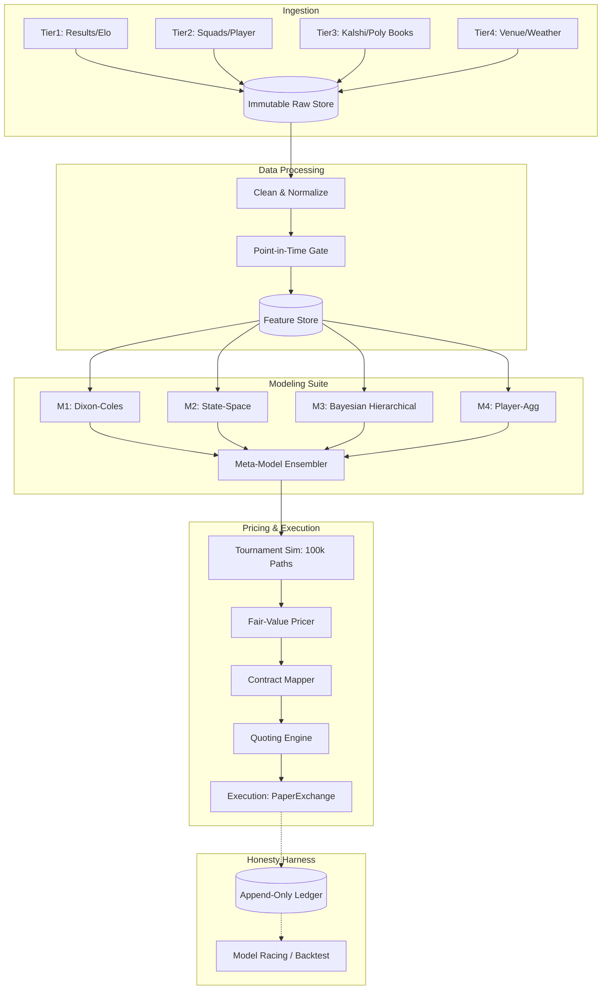

# System Architecture

One closed loop with an honesty harness bolted to the outside.
Strip away the phase numbering and everything below is either *the loop* (turning information into quotes) or *the harness* (making self-deception structurally hard).

## The loop (data -> belief -> price -> quote -> fill)

## The harness (why the loop can be trusted)

Four instruments, all live from Phase 0:

1. **Append-only, hash-chained ledger** (`wc2026.ledger`) — every prediction, price, quote, order, fill is written once and never mutated; tampering breaks the chain and `verify_chain()` detects it.
2. **Hash-everything reproducibility** (`wc2026.hashing`, `wc2026.runs`) — every run records git commit + config/data/feature hashes, so any historical output is re-derivable bit-for-bit.
3. **Pre-registration** (`docs/preregistrations/`) — metric, threshold, and required sample size are frozen *before* each backtest or promotion gate. No moving goalposts.
4. **Point-in-time gate** (`wc2026.pit`) — the single leak-proof access path, enforced by property tests wired into pre-commit.

## Where the edge is — and is not

Edge = model quality + information *timing* (the lineup drop ~60–75 min pre-kickoff is the biggest scheduled information event) + settlement-rule precision + cross-market/joint **coherence** pricing.
Edge is **not** speed.
Retail-dominated, second-scale, binary-payoff books do not reward tick-shaving.
Speed pays in exactly three narrow places, all defensive: order-book **recording fidelity** (honest fill sim + CLV), **quote-pull kill switches** (don't be the stale quote a sharp picks off after a goal/red card), and **reconciliation** (book matches the exchange every cycle).
See `docs/adr/0006-edge-thesis-coherence-settlement-timing.md`.

## Stack

cron + DuckDB + Parquet + plain Python is the default.
Anything heavier (Kafka/Airflow/K8s) requires an ADR naming the measured bottleneck it removes.
A C++ hot path is proposed only after a profiler says so, never before.
See `docs/adr/0002-storage-stack-duckdb-parquet.md`.

## Phase map

| Phase | Name | Status |
|------|------|--------|
| 0 | Architecture, documentation, experiment discipline | **built** |
| 1 | Data & intelligence acquisition | **built** |
| 2 | Point-in-time feature store | **built** |
| 3 | Model suite (M1–M6 + ensembler + uncertainty) | **built** |
| 4 | Tournament simulation engine (joint distribution) | **built** |
| 5 | Fair value, contract mapping, cross-venue pricing | **built** |
| 6 | Market-making & execution engine (paper -> live) | **built** |
| 7 | Evaluation, model racing, backtesting | **built** |
| 8 | Live operations, in-play option, model decay | **built** |
