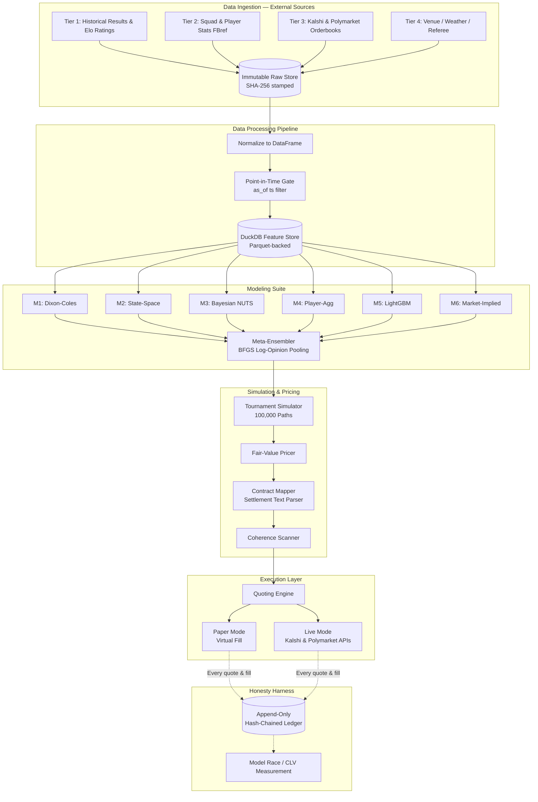
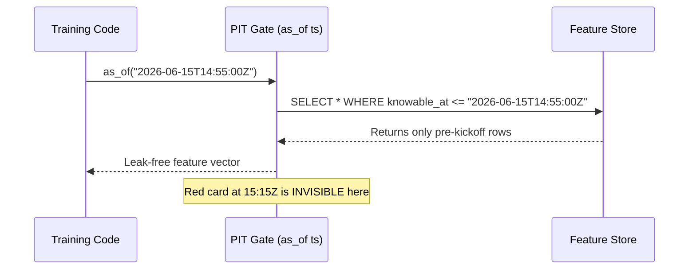
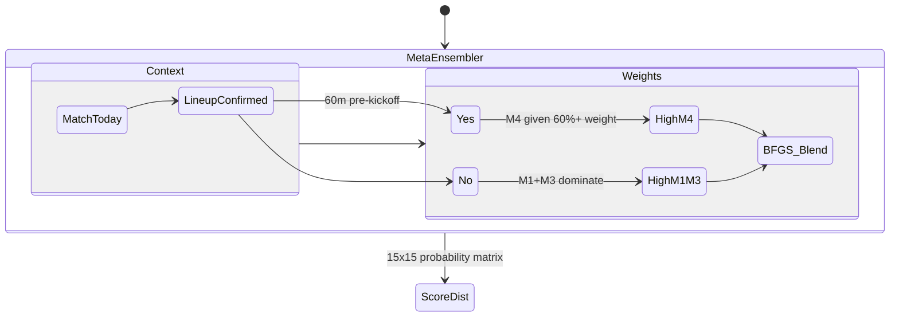
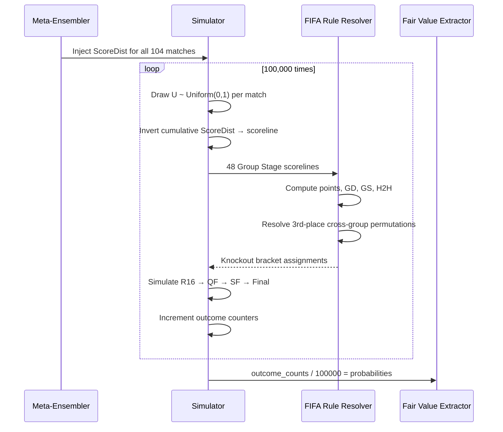
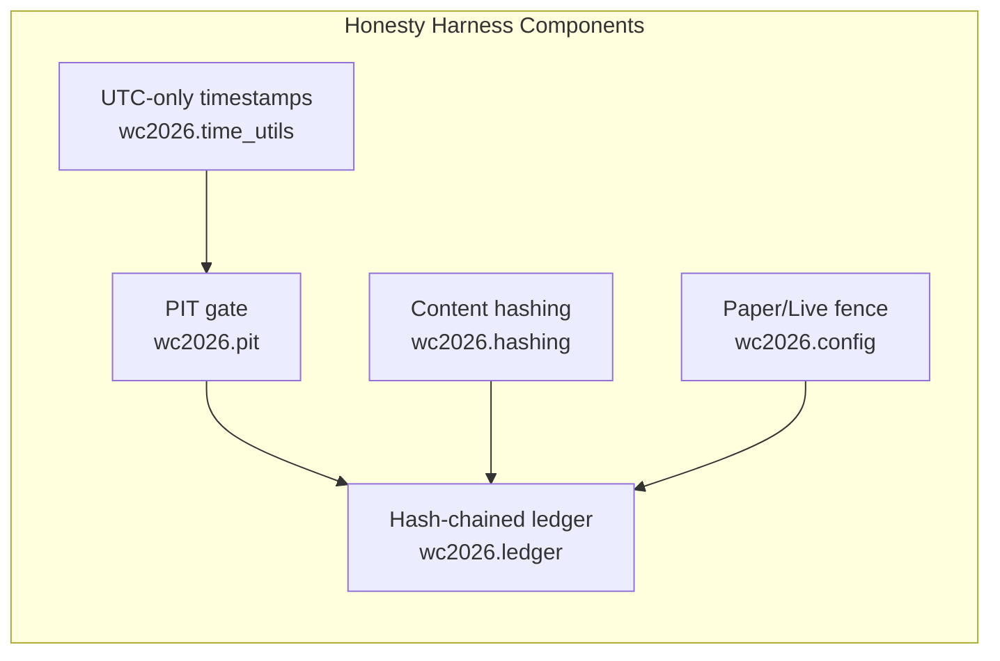

# System Architecture Deep-Dive

The WC2026 Prediction System operates as a closed, deterministic execution loop with a cryptographic **Honesty Harness** bolted to the outside. This document breaks down every major component, how they interact, the engineering rules governing them, and *why* each design decision was made.

> **Prerequisite reading**: The [First-Principles Guide in docs/models.md](models.md) explains the mathematics from scratch. This document focuses on the system architecture and engineering rationale.

---

## Mental Model: The Newspaper Analogy

Think of the system like a quantitative newspaper:

1. **Reporters** (Data Ingestion) go out and gather facts: match results, squad news, market prices.
2. **Fact-checkers** (Normalization + PIT Gate) verify when each fact was *truly* known, discarding anything published late.
3. **Analysts** (Models M1–M6) write independent assessments of each match.
4. **Editor-in-Chief** (Meta-Ensembler) combines the analysts' views into a single probability distribution.
5. **Market desk** (Tournament Simulator + Pricing) translates that probability into a price.
6. **Traders** (Quoting Engine) compare the price to the market and act on discrepancies.
7. **Auditors** (Honesty Harness) record every decision with a cryptographic trail — no retroactive edits.

---

## The Full Execution Loop



---

## Component Deep-Dives

### 1. Data Ingestion & the Raw Store

Every external data source (API, CSV, scrape) is categorized into one of four tiers:

| Tier | Velocity | Sources | Fetch Cadence |
|------|---------|---------|--------------|
| **1** — Historical | Daily | martj42 results DB, EloRatings.net | Nightly cron |
| **2** — Player-level | Weekly | FBref/StatsBomb squad stats, xG | 6-hour intervals |
| **3** — Live markets | Real-time | Kalshi CLOB, Polymarket CLOB, Sharp books | Persistent WebSocket |
| **4** — Context | Per-match | Venue, altitude, weather, referee | 24h pre-kickoff |

Every raw payload is:
1. **Timestamped** at receipt with a UTC nanosecond timestamp.
2. **SHA-256 hashed** so we can verify a cached payload hasn't been modified.
3. **Written to the raw store** (immutable append-only files in `data/raw/`).

This immutability means the raw store is the ground truth. If a cleaning step introduces a bug, we re-clean from the raw payload — we never re-fetch.

---

### 2. Point-in-Time Gate — The Anti-Leakage Boundary

> **Why this is the most important component in the system**: Look-ahead bias is the dominant error in sports prediction. The PIT gate makes it *mechanically impossible* to leak future data into a model, even accidentally.



The gate is implemented in `wc2026.pit.PointInTimeStore`. Property-based tests (via `Hypothesis`) generate thousands of random scenarios and assert:
- `P1`: No fact with `knowable_at > ts` is ever returned.
- `P2`: Every admissible fact with `knowable_at <= ts` is always returned.

These tests run on every `git commit` via `make hooks`.

**DuckDB was chosen over PostgreSQL** for the feature store because:
- Embedded columnar analytics (no network round-trips).
- 10–100× faster on analytical `SELECT`s with temporal filters.
- Zero operational overhead (no database process to manage).
- Parquet integration for long-term compressed storage.

---

### 3. The Modeling Suite

Each of the six models represents an **independent perspective on match outcome uncertainty**:



**The key insight**: The ensemble does not average models — it learns which models to trust, and *when*, based on historical calibration data. Before a lineup is announced, M4 (Player-Aggregation) has no real information (it uses expected lineups). After the lineup is announced, M4 becomes the most accurate model and its weight surges.

#### What is a `ScoreDist` Matrix?

The output of the ensembler is a **15×15 probability matrix**, not a single percentage. Every cell `[x][y]` represents the probability of the Home team scoring exactly `x` goals and the Away team scoring exactly `y` goals.

```
          Away Goals
          0      1      2      3     ...  14
Home  0 | 9.9%  10.3%  5.5%  2.0%  ...  ~0%
Goals 1 | 12.2% 12.7%  6.8%  2.4%  ...  ~0%
      2 | 7.5%  7.8%   4.2%  1.5%  ...  ~0%
      3 | 3.1%  3.2%   1.7%  0.6%  ...  ~0%
     ...
     14 |  ~0%   ~0%   ~0%   ~0%  ...  ~0%
```

From this matrix, any market outcome can be derived:
- **Home Win probability**: Sum of cells where `x > y`.
- **Draw probability**: Sum of cells on the diagonal where `x = y`.
- **Away Win probability**: Sum of cells where `x < y`.
- **Over 2.5 goals**: Sum of cells where `x + y > 2`.
- **Exact scoreline (2-1)**: Single cell `[2][1]`.
- **BTTS (Both Teams to Score)**: Sum of cells where `x > 0 AND y > 0`.

---

### 4. Tournament Simulator — 100,000-Path Monte Carlo

The simulator is the bridge between *single match probabilities* and *tournament outcome probabilities*.

**Why we need simulation (not analytic calculation)**: The WC2026 Group Stage has 12 groups × 6 matches = 72 matches. Each match has thousands of possible scorelines. The knockout bracket adds 32 more matches, with conditional paths that depend on every group stage result. The number of unique tournament paths is astronomically large — analytic exact computation is not feasible. Simulation with 100,000 paths gives us probabilities with a standard error of < 0.15%.



#### Why the 3rd-Place Rules Are Hard

In WC2026, the best 4 of 12 third-place finishers advance. The problem is that which groups those 4 teams came from determines which Round of 16 slot they fill — and therefore which team they face. This cross-group mapping has $\binom{12}{4} = 495$ possible configurations, each with a different bracket assignment table. Our simulator pre-computes all 495 tables and uses a dictionary lookup to resolve in O(1) time per simulation path.

---

### 5. Pricing & Execution

#### Fair-Value Pricer
Converts tournament simulator output probabilities directly into dollar-denominated fair values:

$$
\text{FV} = P(\text{Event}) \times \$1.00
$$

For a compound event (e.g., "France reaches the Quarterfinals"), the probability is extracted directly from the simulator's marginal count.

#### Coherence Scanner
Scans all contracts simultaneously to find:
- **Cross-venue pricing gaps**: "Brazil to win the Final" at 14% on Kalshi vs 16% on Polymarket.
- **Internal bracket coherence violations**: Product of path-conditional probabilities does not match the tournament-winner probability.

Every detected coherence violation is ranked by expected edge and logged. The quoting engine processes the ranked list from top to bottom.

#### Quoting Engine
For each contract:

$$
\text{Edge} = \text{FV} - \text{Market Ask} - \text{Exchange Fee}
$$

If `Edge > risk_threshold` (from config), the engine submits a limit buy order at a price between `Market Ask` and `FV`.

---

## The Honesty Harness

**We assume human researchers (ourselves) will subconsciously cheat during backtesting.** The harness prevents this structurally.



### The Cryptographic Ledger

Every prediction, model weight, orderbook snapshot, and executed trade is written as a line in `data/ledger/ledger.jsonl`:

```json
{
  "seq": 1243,
  "ts_utc": "2026-07-03T02:15:00Z",
  "event_type": "quote_submitted",
  "contract": "BRA-WC-WIN",
  "fair_value": 0.142,
  "market_ask": 0.120,
  "quote_price": 0.130,
  "size_usdc": 100.00,
  "git_commit": "73c6c46",
  "config_hash": "a1b2c3",
  "sha256_prev": "f7e9a2..."
}
```

The `sha256_prev` field contains the SHA-256 hash of the *entire previous row*. This creates a cryptographic chain. If anyone modifies row 100 (e.g., to erase a losing trade), row 101's `sha256_prev` no longer matches, **breaking the chain** and triggering an alert in the CI pipeline.

This means our backtest P&L is *auditable*. A claim of "X% return over Y matches" can be independently verified from the ledger.

---

## Where the Edge Is — and Is Not

| Edge Source | Description | Priority |
|---|---|---|
| **Cross-market coherence pricing** | Joint simulator finds inconsistencies between correlated contracts on same/different venues. | 🥇 Primary |
| **Settlement-rule precision** | Reading contract resolution language more carefully than retail participants. | 🥈 Secondary |
| **Information timing (lineup drop)** | M4 reweighting at confirmed lineup release ~60 mins pre-kickoff. | 🥉 Tertiary |
| **Out-predicting the sharp on 1X2** | ❌ Not a viable edge class for a solo operator. Sharp closing lines are near-efficient. | ⛔ Avoid |
| **In-play speed advantage** | ❌ HFT-like speed in-play is where professional data-feed operators live. | ⛔ Avoid |

> **Edge is not speed.** Python is our primary language. C++ would only be considered for a specific, profiler-proven bottleneck in the 100k-path simulator (currently not needed — vectorized NumPy gives sub-millisecond performance).
