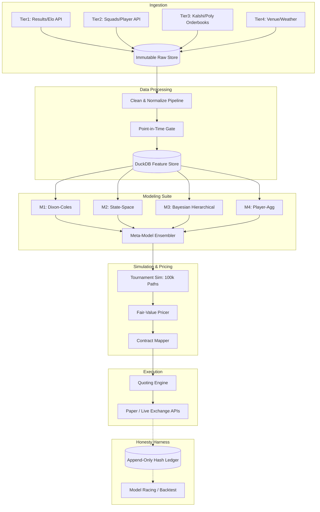
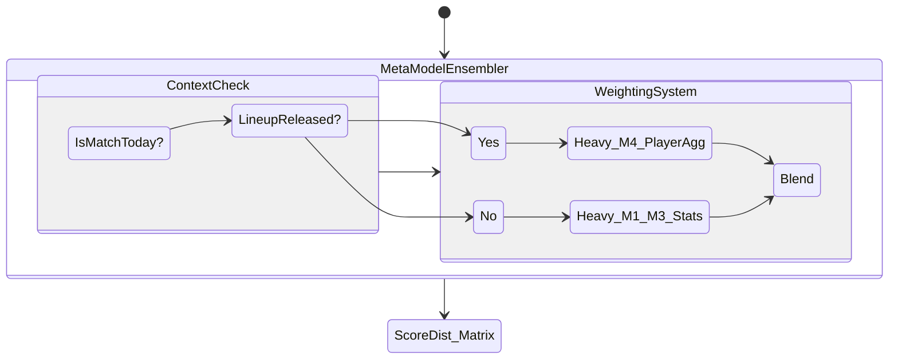
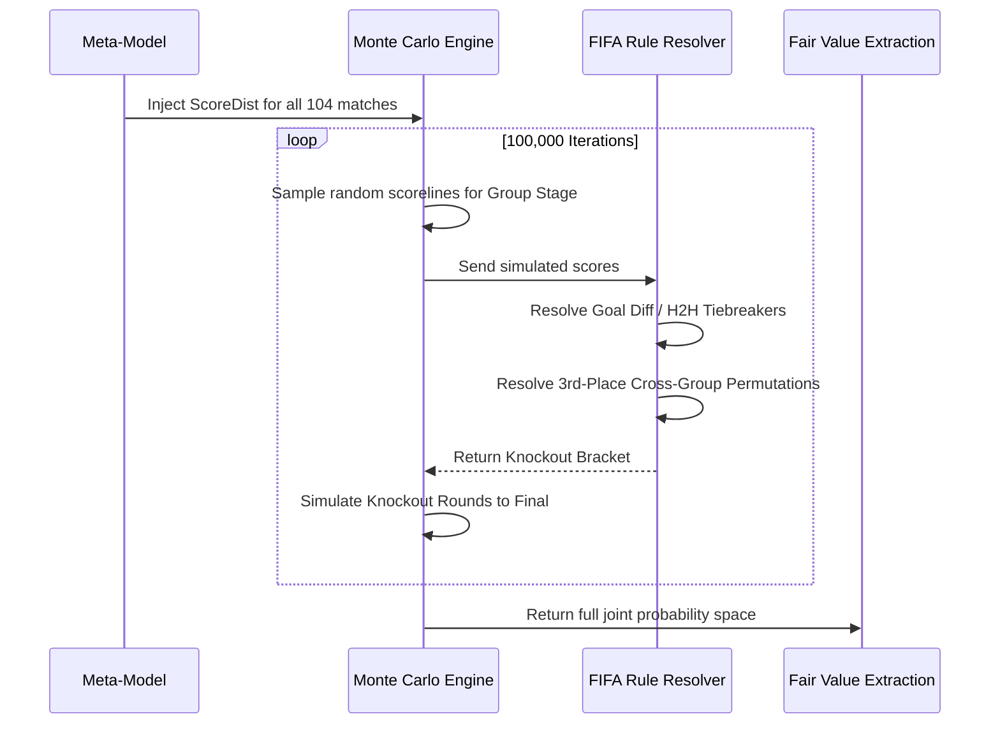

# System Architecture Deep-Dive

The WC2026 Prediction system operates entirely as a closed, deterministic execution loop with a cryptographic "honesty harness" bolted to the outside. This document breaks down the mechanical components of the system, their interactions, and the strict engineering rules governing them.

---

## The Execution Loop (Data ➡️ Belief ➡️ Price ➡️ Fill)

### 1. Ingestion & Data Processing
We categorize incoming data into tiers based on velocity and structural reliability. All incoming JSON and HTML payloads are hashed and dumped directly to a `Raw Store`. Data is subsequently cleaned into DataFrames and pushed to the `Feature Store`.
- **DuckDB + Parquet**: We use DuckDB over Postgres. For this scale of analytics, an embedded columnar store dramatically accelerates `pandas`/`polars` analytics, requiring no network round-trips.
- **The Point-in-Time (PIT) Gate**: The single most critical component for a quant system. `wc2026.pit` ensures that models trained for a match occurring at $T$ can only access data strictly less than $T$. Any leakage breaks the build pipeline.

### 2. The Modeling Suite
The system does not rely on a single model. It relies on a suite of specialized models combined dynamically.

- **M1 (Dixon-Coles)**: A heavily optimized Poisson model providing base expectancy rates for goal scoring, factoring in attack/defense strength adjustments.
- **M2 (State-Space)**: Tracks team form dynamically over time, highly responsive to recent shock results or injuries.
- **M3 (Bayesian Hierarchical)**: Imposes rigid structural priors on teams based on Elo, preventing wild overfitting on small sample sizes (like group stage upsets).
- **M4 (Player-Aggregate)**: Bottom-up aggregation of xG (expected goals) based on squad lineups.
- **The Meta-Model Ensembler**: Evaluates the reliability of M1-M4 under current contextual conditions (e.g., M4 is weighted heavily only *after* the lineup drops 60 mins pre-match).

#### The `ScoreDist` Matrix Explanation
The output of the Ensembler is not a simple "Win/Draw/Loss" probability. It outputs a `ScoreDist` matrix, which is a literal 15x15 probability grid where the X-axis is the Home Team's goals (0 to 14) and the Y-axis is the Away Team's goals (0 to 14). The cell at `[1][0]` represents the exact mathematical probability of a 1-0 finish. By summing the diagonals and triangles of this matrix, we derive the exact Win/Draw/Loss and Over/Under probabilities.

### 3. The Tournament Simulator
The `ScoreDist` matrices only predict individual matches. We run a **100,000-path Monte Carlo Simulator** to resolve the tournament's joint distribution.

- **Topological Mapping**: Evaluates the strict FIFA ruleset (Goal Difference, Goals Scored, Head-to-Head) to simulate group stage standings.
- **3rd Place Logic**: Extremely fast matrix operations to resolve the historically complex 3rd place progression permutations into the Round of 16.

### 4. Pricing & Execution
- **Fair-Value Extraction**: The Simulator yields probabilities for highly specific outcomes (e.g. "Brazil reaches Semi-Finals"). The `Fair-Value Pricer` translates this probability (e.g. 60%) into a Fair Value price ($0.60).
- **Quoting Engine**: Reads real-time orderbooks from Kalshi/Polymarket via WebSockets. It applies maker/taker fee mathematics. If $Edge > RiskLimit$, the engine categorizes the contract as `Tradeable` and submits quotes to the exchanges.

---

## The Honesty Harness (Why we trust the system)

We assume human researchers (ourselves) will subconsciously cheat during backtesting to find alpha. The harness prevents this structurally.

1. **Append-Only, Hash-Chained Ledger (`wc2026.ledger`)** 
   - Every prediction, model weight, and executed paper-trade is written to a JSONL file. Each row hashes the contents of the *previous* row.
   - Any manual tampering of a past loss breaks the cryptographic chain, instantly failing the CI pipeline via `verify_chain()`.
2. **Hash-Everything Reproducibility (`wc2026.runs`)** 
   - Every execution captures the exact `git commit` hash, the configuration hash, and the feature hash. A run from six months ago can be re-run bit-for-bit perfectly today.
3. **Pre-registration Gates**
   - No threshold or metric can be adjusted post-hoc. Acceptance criteria for models are committed to git *before* the evaluation runs.

---

## Where the Edge is — and is not

Our structural Edge is defined by:
1. **Model Quality & Lineup Drops**: The biggest scheduled information event is the lineup drop ~60-75 mins pre-match. Our models shift weight to M4 dynamically here to beat the market.
2. **Settlement-Rule Precision**: Markets frequently misprice complex 3rd-place tiebreakers. Our strict FIFA rule engine accurately prices these tail-risks.
3. **Joint Coherence**: By simulating the entire tournament natively, our pricing intrinsically understands conditional correlations (e.g. "If Brazil wins Group G, Argentina's odds of reaching the Final drop").

**Edge is NOT Speed**.
Retail-dominated, binary-payoff books like Kalshi do not reward tick-shaving or HFT (High-Frequency Trading) architecture. Speed is only utilized defensively to execute kill-switches if a live goal occurs before our models update. Therefore, we use Python over C++ unless a specific profiler demands otherwise.
