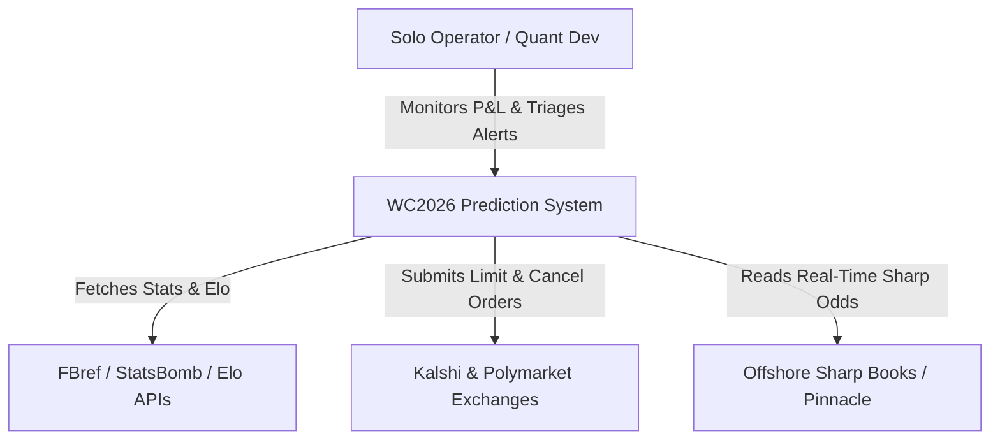
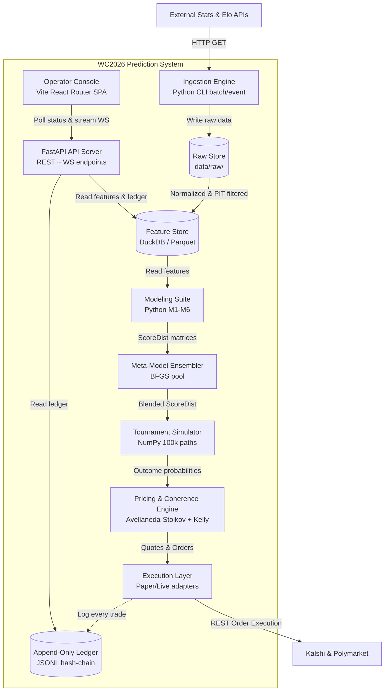

# System Overview & Design Creed

This document provides a high-level explanation of the **WC2026 Prediction System**, its core execution loop, and the quantitative edge thesis guiding its design.

---

## 1. System Overview (C4 Context & Container)

The platform is organized according to the **C4 model** to map the boundaries and containers cleanly.

### System Context Diagram (Level 1)

This diagram shows how the system interacts with external entities (exchanges, statistical data APIs, and the operator).

### Container Diagram (Level 2)

This diagram shows the major executable components and databases running inside the platform's boundary.

---

## 2. The Design Creed: Where the Edge Lives

Many automated sports-betting implementations fail because they attempt to build high-frequency trading (HFT) infrastructure. We explicitly reject this approach. 

> **Edge is a function of information quality, model coherence, and settlement precision — NOT latency.**

### The Three Durable Sources of Edge

1. **Cross-venue and Internal-Coherence Pricing**:
   - *The Reality*: Exchanges price highly correlated contracts (e.g. "Argentina wins Group A" and "Argentina reaches the Round of 16") independently. This creates massive mathematical inconsistencies.
   - *The Exploitation*: Our 100,000-path tournament simulator computes a single, coherent joint probability space. We identify and trade these internal arbitrage opportunities while retail traders price each contract in isolation.
2. **Settlement-Definition Precision**:
   - *The Reality*: Exchange contracts are written in natural language, which often contains subtle nuances (e.g. "advances" vs "wins in 90 minutes", or whether a penalty shootout counts as a "win").
   - *The Exploitation*: We map each contract explicitly to a simulator outcome using structured settlement rules. We avoid trading "apparent" edges that are actually settlement-definition mismatches.
3. **Information Timing (Lineup Drops)**:
   - *The Reality*: When the starting XI is confirmed ~60–75 minutes before kickoff, it represents a massive shift in expected goals.
   - *The Exploitation*: Our M4 model aggregates player-level statistics from club seasons. The moment the lineup drops, we re-price the match immediately, exploiting the latency of human traders who take 15–30 minutes to adjust their books.

### Rationale for Technical Choices

- **Python over C++**: Because our execution loop runs on a 60-second cycle (rather than microseconds), development velocity and mathematical iteration speed are the bottleneck. Python's scientific ecosystem (NumPy, SciPy, JAX, NumPyro) allows us to build complex Bayesian and tree models that would be operationally painful in C++.
- **DuckDB over PostgreSQL**: A solo operator should not spend research time maintaining database processes, setting up backups, or running migrations. DuckDB is a zero-server embedded columnar engine that queries Parquet files directly, performing analytical operations 10–100× faster than row-oriented databases.
- **Vite React Router SPA over Next.js SSR**: Next.js adds server-side rendering (SSR) overhead and complex routing conventions. A clean Vite SPA allows us to write standard React code with immediate local compile times, rendering high-density dashboards that load instantaneously from static client assets.
