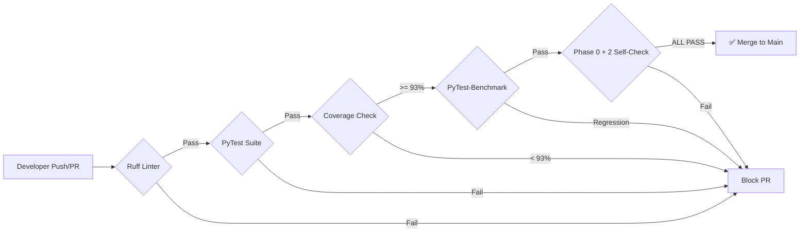
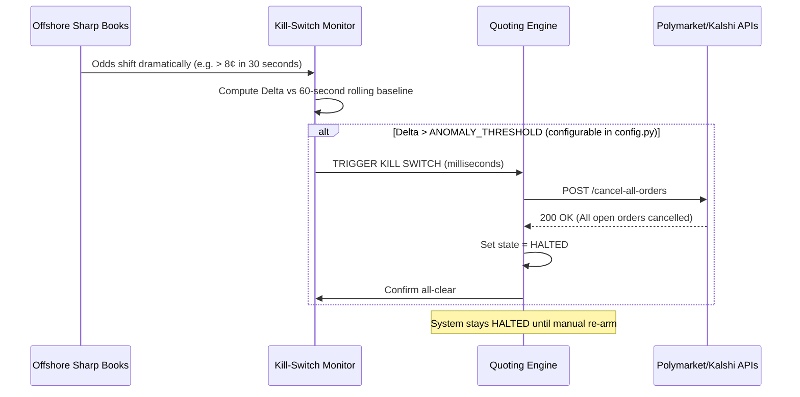

# Operational Runbook

This document is the definitive operational manual for deploying, monitoring, and debugging the WC2026 Prediction System. It covers both Paper Trading and Live environments and is intended to serve as the single source of truth during an active market session.

> **Who should read this?** Anyone operating or debugging this system in production. Assume the reader knows Python but may not know the full system architecture. Always refer to `docs/architecture.md` for deep design explanations and `docs/models.md` for mathematical details.

---

## 1. Local Deployment & Setup

The system enforces strict Python dependencies for reproducibility. We use `uv` and lock dependencies explicitly so that any developer can reproduce an exact environment.

### Prerequisites
- Python **3.12** (pinned via `.python-version`)
- [uv](https://github.com/astral-sh/uv) package manager (`pip install uv` or `curl -LsSf https://astral.sh/uv/install.sh | sh`)
- Node.js **18+** and npm (for the frontend)

### First-Time Setup

```bash
# 1. Clone the repository
git clone https://github.com/shreejitverma/wc2026-quant-prediction-system.git
cd wc2026-quant-prediction-system

# 2. Resolve dependencies and setup virtual environment
#    This creates .venv/, pins Python 3.12, and installs all packages from uv.lock
make setup

# 3. Install pre-commit hooks (CRITICAL — PIT leakage gates run here)
#    This installs the git pre-commit hook that rejects commits introducing look-ahead leakage
make hooks

# 4. Run the end-to-end self-check (verifies the harness is intact)
#    Runs ruff linting, pytest, coverage check, benchmarks, and both self-check scripts
make verify
```

If `make verify` produces all green output, the system is ready to operate.

### Launching the Dashboard Stack

To start the Next.js React Operator Console and the FastAPI backend concurrently, run the launcher script:

```bash
./run.sh
```

This script:
1. Starts `uvicorn` (FastAPI backend) on port **8000** in the background.
2. Starts `vite` (Next.js frontend) on port **3000** (or **3001** if 3000 is occupied).
3. Traps `SIGTERM`/`Ctrl+C` to kill both processes cleanly.

| Service | URL |
|---------|-----|
| Operator Console (React/Vite) | `http://localhost:3000` or `3001` |
| FastAPI Backend + Swagger UI | `http://localhost:8000/docs` |
| WebSocket Feed | `ws://localhost:8000/api/v1/ws` |

---

## 2. CLI Orchestrator Modes

The quantitative engine can be invoked headlessly via the `wc2026.ops.cron` module, which is the correct entry point for cron jobs and CI pipelines.

### Backtesting Mode
```bash
uv run python -m wc2026.ops.cron backtest
```

**What it does**: Runs the full Meta-Model Ensembler across historical fixtures, routing all feature access through the Point-in-Time (PIT) gate. The backtest runner:
1. Loads historical fixtures from the Feature Store.
2. For each fixture, retrieves only the data knowable *before* that fixture's kickoff timestamp.
3. Runs all 6 models to produce a `ScoreDist` matrix.
4. Evaluates the prediction accuracy against the actual result.
5. Writes the run metadata and results to `data/runs/runs.jsonl`.

**Safety**: Because all data access is gated by `pit.PointInTimeStore`, it is *structurally impossible* for the backtest to see post-match data.

### Live Mode
```bash
uv run python -m wc2026.ops.cron live
```

**What it does**: The active execution mode. On every cycle:
1. Fetches live orderbook snapshots from Kalshi/Polymarket.
2. Re-runs the models and tournament simulator.
3. Computes the fair value and edge for every active contract.
4. Triggers the Quoting Engine to submit/update limit orders if `Edge > RiskThreshold`.
5. Every executed quote is recorded to `data/ledger/ledger.jsonl`.

> **CAUTION**: This mode interacts with real exchanges in `live` config mode. Always verify `MODE=paper` is set in `.env` unless you intend to execute real trades.

### Coherence Mode
```bash
uv run python -m wc2026.ops.cron coherence
```

**What it does**: Scans all live orderbooks exclusively to find:
- **Cross-venue arbitrage**: A contract priced at 60¢ on Kalshi and 64¢ on Polymarket (buy one, sell other for risk-free profit).
- **Internal coherence violations**: The product of "Brazil beats France" × "Brazil beats Germany" × "Brazil wins the final" should be approximately equal to "Brazil wins the World Cup". If it isn't, there's a pricing error somewhere in the book.

---

## 3. Continuous Integration & Deployment (CI/CD)

We enforce a strict CI pipeline to protect the mathematical integrity of all model outputs. **No code can be merged without passing all gates.**



The `.github/workflows/ci.yml` enforces the following gates on every pull request:

| Gate | Tool | Threshold | Why it Exists |
|------|------|-----------|--------------|
| **Linting** | `ruff check` | Zero violations | Enforces import ordering and modern Python style (e.g. `datetime.UTC`). |
| **Unit Tests** | `pytest` | 100% pass | Every model, pricing, PIT, and ledger function must be tested. |
| **Coverage** | `pytest-cov` | **≥ 93%** | Prevents untested edge cases (e.g. tiebreaker logic) from reaching production. |
| **Benchmarks** | `pytest-benchmark` | No regression | Guards simulator and MetaModel fit hot-paths from performance degradation. |
| **Self-Check** | `phase0_selfcheck.py` + `phase2_selfcheck.py` | ALL PASS | Verifies the full honesty harness: ledger chain, PIT gate, DuckDB, and Elo pipeline. |

---

## 4. Troubleshooting & Debugging

### 4a. Checking the Hash Ledger

If a trade or quote looks suspicious (unexpected position sizing, anomalous probability output), the first step is always to query the cryptographic ledger:

```bash
# View recent ledger entries
tail -n 20 data/ledger/ledger.jsonl | python -m json.tool

# Verify the cryptographic chain is intact
uv run python -c "from wc2026.ledger import verify_chain; print('OK' if verify_chain() else 'CHAIN BROKEN')"
```

If `verify_chain()` returns `False`, **someone or something manually modified a past ledger row to hide a trade or loss**. This is the primary signal of unauthorized tampering. The system should be paused and all trades audited manually.

### 4b. Point-In-Time Gate Debugging

If a backtest produces suspiciously good results that don't generalize, the first hypothesis is look-ahead leakage. Verify the PIT gate:

```bash
# Run the PIT property-based tests with verbose output
uv run pytest tests/test_pit.py -v
```

If these tests fail, a code change has broken the PIT invariant. **Do not run live or backtest until this is resolved.**

### 4c. API & WebSocket Debugging

If the frontend shows stale data or the WebSocket feed drops:

```bash
# Check backend health directly
curl http://localhost:8000/api/v1/health | python -m json.tool

# Tail the uvicorn server logs (visible in run.sh terminal output)
# Verify the WebSocket is broadcasting via wscat:
npx wscat -c ws://localhost:8000/api/v1/ws
# Then send: {"subscribe": ["health", "ledger"]}
```

### 4d. Model Divergence Debugging

If a model's predicted probabilities diverge drastically from the market (>20%), investigate:

1. **Check data freshness**: Is the feature store stale? Run `uv run python -m wc2026.ops.cron coherence` to see freshness status.
2. **Check the Elo pipeline**: Run `uv run python scripts/phase2_selfcheck.py` — this validates the entire Elo rating update chain.
3. **Isolate the model**: Run individual model predictions via the Python REPL to identify which of M1-M6 is outputting unexpected values.

---

## 5. Disaster Recovery Matrix

| Failure Scenario | Automated Response | Manual Mitigation |
|---|----|---|
| **Exchange WebSocket Disconnect** | Quoting Engine automatically pauses quotes; retry with exponential backoff. | Monitor `logs/ws_disconnect.log`. Check exchange status page. Re-arm manually when feed is stable. |
| **FBref/Elo Source Unavailable** | Models use last-known cached feature values; PIT gate timestamp remains accurate. | Verify `data/raw/` has recent cached payloads. Switch to backup data source if outage >6h. |
| **Model Probability Diverges >20% from Market** | Alert logged to ledger with severity `WARNING`. Quoting Engine widens spreads to defensive levels. | Run `phase2_selfcheck.py`. Check Elo pipeline. Manually inspect `ScoreDist` matrix for anomalies. |
| **Ledger Chain Break Detected** | System halts all trading immediately. Sends `CHAIN_BROKEN` alert. | Halt all operations. Run `verify_chain()`. Audit recent JSONL entries for manual modifications. |
| **Coverage Drops Below 93%** | CI pipeline blocks the merge. | Add test coverage for the new code path before merging. |
| **Live Goal Scored Before Model Updates** | Kill-switch triggered by offshore odds shift detector. | See Section 5: Emergency Kill Switches below. |

---

## 6. Emergency Kill Switches

Our architectural edge is model quality, not HFT speed. However, speed is used **defensively**. If a live match experiences a sudden, unpredicted event (a red card, a goal) before our external data APIs (FBref) can update our models, stale quotes will be left on the exchange that sharp traders will immediately pick off.

### Kill Switch Lifecycle



### Manual Kill Switch Operations

```bash
# Trigger kill switch immediately (CLI)
uv run python -c "from wc2026.execution.kill_switches import trigger_kill_switch; trigger_kill_switch(reason='manual')"

# Check system halt status
uv run python -c "from wc2026.execution.kill_switches import is_halted; print(is_halted())"

# Re-arm the system (deliberate CLI act — not in the UI)
# This requires explicit acknowledgment in the ledger
uv run python -c "from wc2026.execution.kill_switches import rearm; rearm(confirmed_by='operator')"
```

> **Design intent**: The kill switch can be triggered from the Next.js Operator Console (upper-right Command Palette → "Kill Switch"). However, **re-arming** is a deliberate CLI-only act to prevent accidental re-activation via a misclick.
