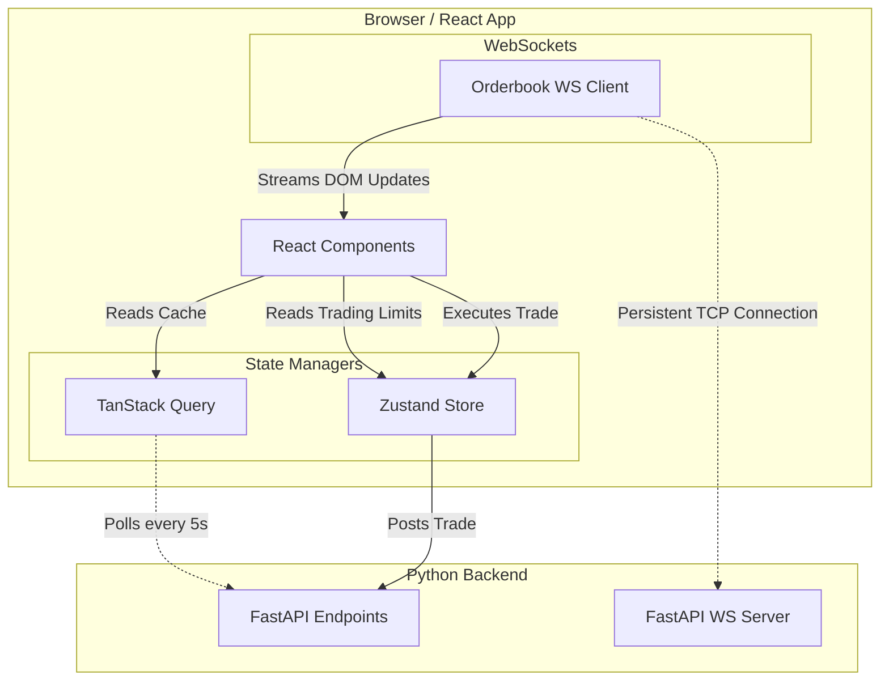

# WC2026 Operator Console (Frontend)

The Operator Console is a strictly utilitarian, desktop-first Next.js React application designed for quantitative researchers executing trades on the prediction markets for the FIFA World Cup 2026. 

## Architectural Philosophy
The goal is not a consumer-grade generic dashboard. The goal is the best possible operator console for a solo quant running a live market-making system. 
- **Information Density**: High density of quantitative metrics (Expected Value, Alpha, Greeks).
- **No Placeholders**: Never confuse a loaded number with a validated number.
- **Explainability**: Every model's weighted contribution to an aggregated probability must be immediately accessible.

---

## 🛠️ Tech Stack & State Architecture

- **Framework**: `Next.js` (App Router configuration)
- **Data Fetching**: `TanStack Query (React Query)`. Used for robust background polling, caching, and synchronization with the FastAPI backend without overwhelming the browser thread.
- **State Management**: `Zustand`. Used for global state holding the Paper Trading Blotter (`tradingStore.ts`) and tracking risk limits like `maxPositionSize`.
- **Real-time Streaming**: Native `WebSockets`. Hooked up directly via React `useEffect` to stream live orderbook updates (Bids/Asks) rapidly directly into DOM components like the `MarketDepthPanel`.
- **Styling**: `Tailwind CSS` heavily optimized for dark mode tabular displays.

### Frontend Data Flow
To prevent the React main thread from locking up during heavy market volatility, state is aggressively decoupled:



---

## 🚀 Running the Console

Ensure you are in the `/frontend` directory, then:

```bash
# Install Node dependencies
npm install

# Run the development server
npm run dev
```

> **Note**: For the console to receive data, the Python FastAPI backend must be running concurrently. You can launch both natively from the root project directory via `./run.sh`.

---

## 📁 Key Components Directory

- `src/app/page.tsx`: The main `CommandCenter` containing the top-level aggregates.
- `src/app/matches/page.tsx`: The quantitative match preview showing team form, historical Elo bounds, and scoreline heatmaps derived from the joint distributions.
- `src/app/markets/page.tsx`: The execution blotter. Shows the expected Fair Value vs the actual Bid/Ask on Polymarket and Kalshi.
- `src/lib/api.ts`: Centralized fetcher logic wiring `TanStack Query` to the `http://localhost:8000/api` endpoints.
- `src/store/tradingStore.ts`: The Zustand implementation holding the active array of trades and risk drawdown limits.
- `src/components/MarketDepthPanel.tsx`: High-frequency WebSocket consumer for visualizing real-time trading depth.

## Performance budget (Phase 6 hardening)

Measured on the production build (`npm run build`, Vite 8):

| Metric | Budget | Current |
|---|---|---|
| JS bundle (gzip) | < 200 KB | ~125 KB |
| CSS (gzip) | < 20 KB | ~10 KB |
| Production build time | < 5 s | ~0.3 s |
| Route interaction (client-side nav) | < 100 ms | instant (SPA, cached queries) |

If the JS budget is threatened (recharts is the heavy dependency), lazy-load
the chart-bearing routes before reaching for anything more exotic.

## E2E smoke tests

`npm run test:e2e` (Playwright) boots a FastAPI instance against a scratch
ledger root (`../e2e-data`, wiped per run) plus a Vite dev server on :3000,
then drives the critical paths: mode banner truth, opportunity board rows +
quarantine, the full kill-switch flow (typed phrase → ledgered command →
KILLED strip → entry visible on the Ledger page), and matchday. The scratch
root exists because the kill test really kills - and a kill in the real
append-only ledger sticks until a CLI re-arm exists.
