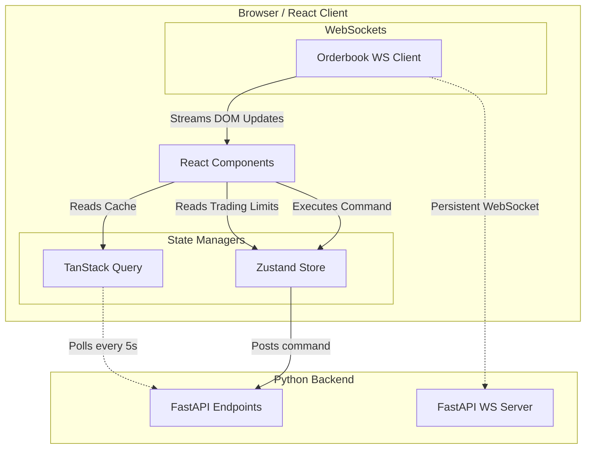

# WC2026 Operator Console (Frontend)

The Operator Console is a strictly utilitarian, desktop-first Vite React Single Page Application (SPA) designed for quantitative researchers executing trades on the prediction markets for the FIFA World Cup 2026.

---

## Tech Stack & Architecture

- **Core Library**: `React 19`
- **Build Toolchain**: `Vite 8` + `@vitejs/plugin-react-swc`
- **Routing**: `React Router 8` (App SPA Client routing)
- **Data Fetching**: `@tanstack/react-query` (TanStack Query / React Query) for polling, query caching, and synchronization with the FastAPI backend without blocking the render loop.
- **State Management**: `Zustand` for state tracking of the active blotter (`tradingStore.ts`) and holding risk drawdown boundaries.
- **Real-Time Streaming**: Native `WebSocket` connection streaming live Level 2 orderbook bids/asks directly into the DOM (e.g. `MarketDepthPanel.tsx`).
- **Styling**: `Tailwind CSS v4` optimized for dark-mode financial displays.
- **UI Base**: `@base-ui/react` + `lucide-react` icons.

### Frontend-to-Backend Topology



---

## 🚀 Dev Setup & Run

Ensure you have Node.js 18+ installed.

```bash
# Navigate to the frontend workspace
cd frontend/

# Install dependencies
npm install

# Run the development server
npm run dev
```

The Operator Console will run on `http://localhost:3000` (or `3001` if port 3000 is occupied).

> **Full-Stack Launch**: To run both the FastAPI Python server and Vite UI concurrently with single-process cleanup, execute `./run.sh` from the project root.

---

## 📁 Key Source Files

All application source code resides under `src/`:

- `src/main.tsx`: App bootstrapping, imports global CSS and fonts.
- `src/App.tsx`: Central router configuration (`/`, `/matches`, `/markets`, `/ledger`) and layout frame.
- `src/pages/CommandCenter.tsx`: The home view aggregating health statuses, active quote metrics, and the main blotter.
- `src/pages/Matchday.tsx`: Previews individual matches, showing team rest days, relative form, altitude vectors, and the 15×15 scoreline probability heatmap.
- `src/pages/Opportunities.tsx`: Displays live arbitrage opportunities with EV calculations and fair value intervals.
- `src/pages/Ledger.tsx`: Renders the hash-chained append-only event log.
- `src/components/MarketDepthPanel.tsx`: High-frequency L2 orderbook visualizer consuming WebSocket increments.
- `src/store/tradingStore.ts`: Global Zustand store for blotter positions and transaction states.
- `src/lib/api.ts`: Setup for openapi-fetch clients communicating with `/api/v1` backend endpoints.

---

## 🎭 E2E Testing with Playwright

We enforce end-to-end correctness using Playwright. Playwright tests:
1. Boot a fresh FastAPI backend against a clean scratch data path (`../e2e-data`).
2. Launch the Vite dev server on port 3000.
3. Test critical paths:
   - Verification of the mode banner (verifies it displays "Paper Mode").
   - Quoting blotter entries and EV opportunities.
   - The **Kill Switch flow**: types the confirmation phrase, submits, verifies the "KILLED" state appears in the UI, and asserts that the corresponding stop event was committed to the Ledger.

Run the Playwright E2E suite:
```bash
npm run test:e2e
```
